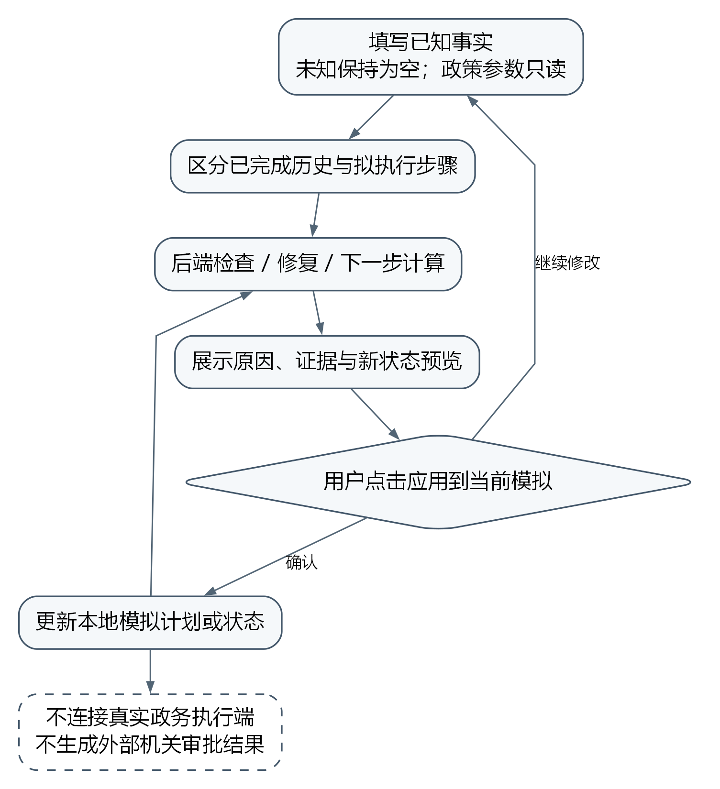
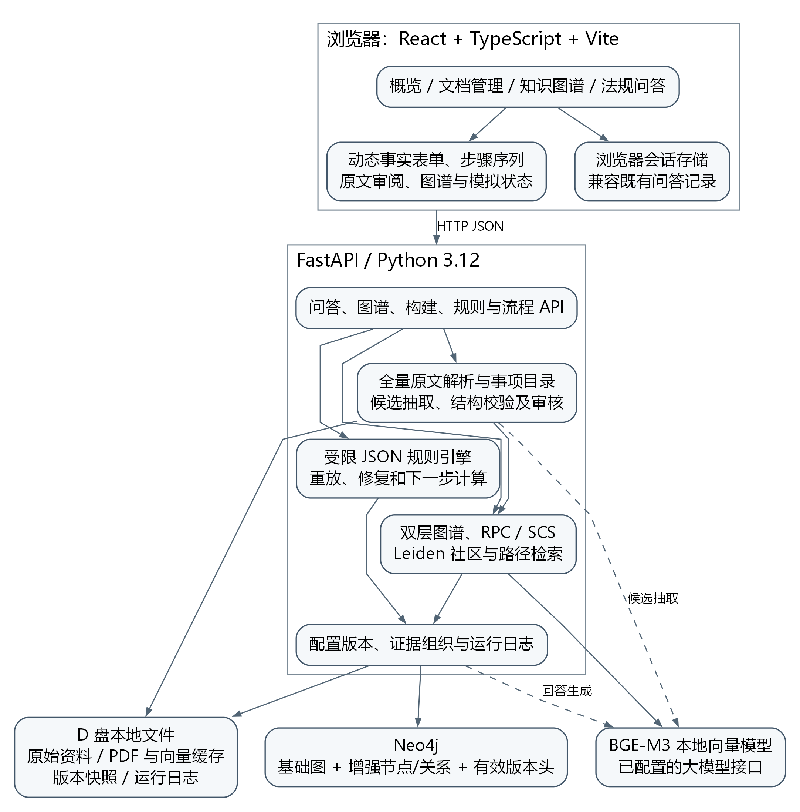

# 第5章 规则因果增强问答、流程纠错与原型系统

## 5.1 引言

前两章所构建的知识图谱和检索机制，解决的是政策知识如何表达以及相关证据如何组织的问题。面向办理活动的系统还必须回答另一个问题：检索结果应当怎样转化为用户能够理解、能够核对且不会混淆现实审批状态的交互结果。政策问答中的语言解释与流程检查中的状态判断具有不同性质。前者需要根据问题选择表达方式，后者则要求相同输入得到可复算的结果。若把两者都交给生成模型完成，即使模型提供了形式完整的步骤说明，也难以保证年龄条件、材料要求和先后关系被稳定执行。

本章将问答解释、规则判定和模拟状态更新组织为相互配合但职责明确的三个环节。生成模型负责依据原文组织答案，规则引擎负责受限表达式和状态转移的计算，浏览器负责接收用户确认并保存当前模拟。系统不会把语言模型声称“已审核通过”转换为事实，也不会把页面上点击某个按钮解释为真实机关已经执行该操作。通过这一划分，图谱中的方向关系能够参与检索和流程检查，而最终回答仍然受到原文证据、已知事实与知识缺口的共同约束。

本章首先说明三种检索模式与问答输出协议，随后给出有序流程重放和编辑修复方法，进一步介绍下一步预览、版本化持久化与前后端实现。章末讨论工程验证的对象与系统边界。科研效果比较及其统计分析集中在第6章设计，本章不以功能演示替代科研结论。

## 5.2 证据约束的审批问答

### 5.2.1 问题上下文与两类资料库

一次问答输入除自然语言问题外，还可以包含办理事项、地域、业务日期和已经确认的事实。事项用于缩小候选知识范围，地域和日期用于规则适用性判断，事实用于执行条件表达式。历史会话只作为解释追问的语言上下文，不能自动成为经过确认的案件事实。例如，上一轮回答中出现“假设连续缴存六个月”，并不意味着当前申请人的缴存事实已经被确认为六个月。只有结构化事实输入中的明确取值才会进入规则计算。

为兼容既有演示数据，系统区分上传文档库与研究资料库。原有上传文档仍沿用文档分块、向量索引和普通实体关系查询流程；研究资料库则以本研究的36份政策和8篇文本层PDF为来源，增加条款单元、事项、规则、动作与版本记录。旧客户端不传入新增资料库字段时，继续使用原有接口行为。研究模式下的向量检索、普通图扩展与因果增强检索使用同一份解析语料，从而避免在后续实验中把数据范围变化误认为方法改进。

研究文献与规范性政策具有不同证据地位。PDF页可参与背景问题的文本检索，并保留文献名称和页码；其学术观点不能直接生成决定性的审批规则。政策单元则保留法规标题、条款位置、原始文件路径和内容哈希。系统在答案中列出编号来源，使用户能够区分“研究论文中的讨论”与“政策条款中的办理条件”。这一来源类型区分在数据进入系统时建立，而不是在答案生成之后依靠措辞补充。

### 5.2.2 基线与增强模式的输出差异

向量模式根据问题向量与文本表示的相似度选取证据，主要反映文本相关性检索的能力。普通图模式在初始文本结果周围使用宏观关系进行无向邻接扩展，补充共享法规、事项或结构关系关联的单元。它不使用微观前置约束来证明动作可执行。因果增强模式进一步执行社区筛选、有向候选搜索、规则与动作检查和必要证据补齐。三种模式都保留答案、引用和检索来源字段，以便使用相同的后续评价口径。

增强模式额外返回有序节点及边、社区归属、路径评分分量、规则检查结果和知识缺口。结构化结果不是生成模型从答案文本中反向抽取的解释，而是检索服务及规则引擎的直接输出。因此，即使模型没有把每个条件都写入自然语言答案，页面仍能独立展示哪些字段缺失、哪些条件不满足以及依据来自何处。相反，即使模型表达得非常肯定，结构化检查结果为未知时，系统也不会把该回答显示为确定的流程通过状态。

基础模式的使用同样需要说明边界。相似度较高的条款并不等于适用于用户当前情况；普通图上的连通关系也不等于前置条件成立。因此，基础模式返回的提示说明其没有执行完整规则与流程校验。该提示是对计算范围的解释，不是对某种检索方法效果优劣的预判。后续实验应分别衡量相关证据召回、条件判断与回答忠实性，不能只因增强模式返回了更多字段，就认定其答案质量更高。

### 5.2.3 必要证据与生成提示组织

生成输入由问题、少量历史会话、当前适用域、编号原文和结构化检查摘要共同构成。原文被明确视为待解释的数据；其中可能出现的指令语句不具有改变系统规则或调用外部操作的权限。检查摘要包含规则名称、满足状态、缺失字段和原因，有序证据链则说明检索服务如何组织这些材料。系统不要求模型披露内部推理过程，也不把模型生成的“推理链”视为程序已经验证的证据。

在组织AND条件时，单条有向路径只说明其中一条依赖链的存在。服务需要回到规则或动作的完整表达式，收集同一必要条件集合的全部引用，再对条款编号去重。若所需证据集合超过当前预算，系统不能任意截取一部分后宣称条件完备，而应舍弃该执行性路径或报告证据预算不足。原型默认一次组织至多八个来源单元；这是工程配置中的资源限制，不是关于政策理解所需证据数量的理论上界。

路径上的规则和动作分别接受检查。对于动作已经违反前提的路径，完整模式将其从执行候选中排除；对于缺少事实或外部确认的路径，可以保留其解释价值，但必须标为未知。保留未知路径能够帮助回答“还需要提供什么”，却不能回答为“已经具备办理资格”。在没有可用执行路径时，系统仍可返回相关政策原文，并说明当前只能提供检索核对。该降级结果不产生模拟动作，也不会更新案件状态。

生成阶段的消融开关仅移除有序证据链，仍保留规则判断与知识缺口摘要，从而使后续实验能够单独观察证据顺序组织的影响。若同时移除规则判断、适用日期和缺失事实提示，就会把多个因素混合为一次变化，无法说明差异来自何处。因此，消融实现不仅需要界面选项，还需要明确每个选项实际改变的计算环节及保持不变的输入。

## 5.3 面向办理序列的状态重放

### 5.3.1 案件与动作的形式化表示

将一次模拟案件表示为

$$
X=(m,\ell,t,F,H,P,g), \tag{5-1}
$$

其中，$m$为事项，$\ell$为地域，$t$为业务日期，$F$为已知事实映射，$H$为现实中已经完成的历史步骤，$P=(a_1,\ldots,a_n)$为拟执行步骤，$g$为目标。历史与计划采用两个不同字段保存，以防止编辑计划时无意撤销现实中已经发生的行为。相同动作名称在不同事项中具有不同标识，例如“提交申请”必须与其所属事项、来源和后续状态共同解释。

一个动作可以写为$a=(\operatorname{pre}_a,\operatorname{eff}_a,k_a,E_a)$，分别表示前置表达式、效果映射、动作类别和证据集合。动作类别区分用户可模拟行为与外部结果记录。准备材料属于可模拟行为，但只有被字段模型声明为可变的材料状态才允许被修改；年龄、身份、已经发生的事故时间等事实不随模拟操作改变。模型也不能通过新增动作把外部决定重新归类为用户可变事实。

系统进一步区分申请人事实、政策参数和外部核验结果。申请人可以补充自己已知的材料、缴费经历等信息；政策参数取自事项配置，例如资料中能够确定的比例或上限，不接受同名输入覆盖；外部核验结果必须由当前请求中已经明确确认的事实支持。若资料尚未提供某个动态参数，其状态保持未知，而不是允许用户任意填入一个期望值使贷款额度条件成立。

外部动作采用“记录已知结果”的语义。例如，模拟计划可以包含“记录银行初审通过”，但执行该步要求输入事实已经说明银行完成并通过了本次初审。该动作不能从“已提交申请”自动推导出“初审通过”。这使得整个办理流程能够在图和页面中完整表达，同时避免模拟程序越过机构权限边界。

### 5.3.2 条件核查与步骤前提的绑定

事实条件核查和流程前置判断的适用位置不同。用户询问某项年龄要求时，可以在没有步骤序列的情况下执行该条件；但整理申请材料通常不应以满足最终领取待遇资格为前提。若把全部资格规则设置为每个动作的全局条件，就会出现“尚未准备材料，所以不能执行准备材料”的循环阻塞。

原型通过动作标识绑定必要规则，并对独立条件核查作出显式标记。无步骤的条件检查可以计算这类规则，而有序重放只在对应动作到来时执行其前提。准备阶段依据准备动作自身的来源和条件计算；提交阶段再检查年龄、材料或缴存等必要条件。修复搜索与下一步预览使用相同的动作绑定关系，不会为了得到可行计划而临时关闭资格判断。

这一处理并不意味着步骤输入可以绕过条件。未满足年龄条件的申请人可以整理材料，但在提交或领取等受约束动作处仍会被拦截。对于缺少配套办法的事项，即使某些准备步骤有据可查，也不能据此宣称整个事项已经具备完整审批能力。系统需要分别报告可检索、可校验条件、可模拟流程和可生成修复四种能力。

### 5.3.3 三态计算与首个问题定位

规则求值结果属于集合$\{\mathrm{T},\mathrm{F},\mathrm{U}\}$，分别表示满足、不满足和未知。缺失值、非法类型、没有定义的前置动作，以及不能确认的有效期都不能被转换为零或假。对AND而言，存在已知不满足项即可判为不满足；没有不满足项但仍有未知项时为未知。对OR而言，存在已知满足项即可判为满足；没有满足项且仍有未知项时为未知。例外条件通过NOT及其嵌套结构保持原有含义。

在状态$s_i=(F_i,C_i)$下，只有当前动作的适用性和全部必要前提得到满足，才允许执行效果更新：

$$
s_{i+1}=\gamma(s_i,a_i),\qquad
\gamma(s_i,a_i)=(F_i\oplus\operatorname{eff}_{a_i},\ C_i\cup\{a_i\}),\tag{5-2}
$$

其中$\oplus$表示受字段角色和可变性限制的赋值。若条件不满足或未知，重放停留在此前状态，并返回问题位置、动作名称、条件结果和引用。历史段出现问题时单独标记为历史问题，不能通过修改拟执行序列掩盖原始记录的不一致。目标条件在序列结束后计算；已经正确执行若干步骤，也不等于目标已经达到。

“首个问题”是相对于给定有序序列和当前知识版本而言的。它便于定位最先需要处理的环节，却不保证修复该处后其余步骤都成立。系统因此返回修复计划时必须完整重放，而不能只检查被改动的局部。页面也分别呈现操作错误、信息不足、知识缺口与外部结果未确认，避免把所有失败都归因于申请人操作不当。

## 5.4 基于状态空间搜索的流程修复

### 5.4.1 修复对象与代价

修复目标是修改尚未执行的计划$P$，使其在保持$H$和不可变事实的条件下，通过同一规则引擎并满足目标$g$。允许的序列操作包括保留、插入、删除和替换。调整顺序可以由删除原位置的动作再在适当位置插入表示。材料补充则通过有来源的准备或补正动作表达，不直接把缺失材料字段改为真。

当前实现使用单位编辑成本：保留成本为0，插入、删除和替换的成本均为1。因此，一个修复方案$R$的代价为

$$
\operatorname{cost}(R)=\sum_{e\in R}c(e),\quad
c(e)=\begin{cases}0,&e\text{为保留},\\1,&e\text{为插入、删除或替换}.\end{cases}\tag{5-3}
$$

这是一种具有明确定义权重的序列对齐形式，尚未依据用户时间、办事费用或机构工作量学习不同动作的成本。论文中的最低成本仅指上述代价函数下的最优解，不能解释为现实生活中最快、最便宜或最值得采取的办理方案。正式实验若比较不同成本设置，必须另行记录配置和业务解释。

### 5.4.2 包含序列位置的搜索状态

仅使用事实集合构造搜索状态是不够的。两个节点即使具有相同事实和已完成动作，若已经消耗的原始序列长度不同，其后续可选择的保留和替换操作仍然不同。为此，搜索状态包含原始序列位置$i$：

$$
z=(i,F,C),\qquad 0\le i\le |P|.\tag{5-4}
$$

插入一个动作后位置$i$不变；删除原动作后位置增加1而业务状态不变；保留或替换后同时推进位置并重放所选动作。状态键记录规范序列化的事实及已完成动作集合，以减少反复回到等价状态的搜索。路径本身仍保存有序步骤和编辑记录，用于展示与最终验证。

系统使用按累计代价排序的优先队列。取出一个状态后，先判断是否已经消费完原序列且达到目标；否则枚举允许的编辑及其动作后继。所有真正执行动作的后继都必须经过前置规则、字段类型、外部确认和效果可变性的统一检查。不能用搜索算法自身的便利条件代替业务规则。

在非负成本、有限可达状态且搜索没有被边界截断的前提下，Dijkstra搜索首次取出的有效终点具有该搜索空间中的最低累计成本。[Dijkstra1959] 这一性质来自优先队列的最短路扩展顺序，成立范围是声明的动作集合和状态表示。系统并未枚举政策库之外的可能办理方式，也不能保证资料缺失时仍然包含真实世界的最优方案。

算法5-1给出主要过程。

```text
输入：事项知识 K，已知事实 F，不可撤销历史 H，待执行序列 P，目标 g
1. 重放 H；若历史有问题，返回不可修改历史或信息不足。
2. 将初始状态 (0, F_H, C_H) 以成本 0 放入优先队列。
3. 取出成本最小且尚未被更优记录替代的状态。
4. 若到达原序列末尾且目标满足：完整重放修复计划，通过后返回。
5. 生成删除当前原动作的后继，成本增加 1。
6. 对每个规则允许的动作，生成插入、保留或替换后继。
7. 只保留到同一状态键的更低成本记录。
8. 队列耗尽时区分无解与存在未知条件；达到状态上限时返回截断。
```

图5-2展示了输入、状态扩展、终点检查与结果重放之间的关系。


### 5.4.3 结果类别与计算边界

修复接口区分原计划有效、已找到修复、信息不足、在当前动作空间内无解和搜索截断。原计划有效时返回零成本；找到修复时同时返回编辑项、修改后步骤、累计成本和重新检查结果。信息不足表示存在未确定的规则或事实，不能据此宣布无解。搜索截断表示算法尚未完成声明空间的检查，也不能把当前未找到方案解释为没有方案。

原型默认最多扩展5000个状态。该上限用于控制交互等待与内存开销，并非经过参数调优得到的最优设置。搜索空间可能随动作数量、可变事实组合和序列长度迅速增长，因此状态键去重与成本剪枝具有直接工程意义。实现不承诺处理任意规模规划问题，也未引入学习型启发函数或领域最优性证明。

为验证最低成本实现是否符合其声明，工程测试在小规模动作系统中枚举合法序列，并计算其与输入序列之间的编辑成本，与搜索返回结果比较。测试还覆盖材料准备会改变后续动作可执行性、不同原序列位置对应相同事实、无解、未知以及截断等情况。这些测试可以暴露搜索状态漏掉位置变量等实现错误，但不能替代真实办理场景中的成本评价。

## 5.5 下一步预览与模拟推进

页面从当前事实及已完成历史请求下一步，逐一检查当前事项中尚未完成的候选动作，不提前执行仍在编辑的待办计划。后端通用接口若显式收到计划，会先按该计划重放；页面的“查看当前下一步”请求则将计划段置空。每个候选返回名称、满足状态、缺失字段、证据和预览状态；尚不满足的候选没有可应用的新状态。界面不会在展示推荐时立即修改事实，而是等待用户点击“应用到当前模拟”，才记录动作完成并更新本地事实。

排除已完成动作是必要的。动作效果在本文模型中是常量赋值，重复执行一个已完成动作既不会改变状态，也不对应任何办事含义；若把它计入候选，用户会在推荐列表首位看到刚刚完成的步骤。该问题在第6章的推荐实验中被发现并修正，修正前后 Top-1 命中率由 0.000 变为 0.927，平均候选数由 3.08 降至 1.26（见 6.6.3）。这一情形也说明：候选集合的定义属于任务语义而非接口细节，仅靠单元测试检查返回结构不足以发现此类缺陷。

对于实际已经完成的动作，页面提供单独的历史列表；对于仍在规划的动作，提供可调整的有序列表。修复结果只能作用于计划部分。布尔输入包含未知状态，数字和日期输入为空时保持缺失。政策参数采用只读展示，外部事实则以明确的确认字段呈现。结构化表单由后端事项目录提供，因此不同事项不需要在页面中分别维护一套固定样例。

图5-3所示闭环以用户确认作为本地状态变更的入口。这里的确认仅用于当前模拟，不对应真实业务接口调用。系统没有对接政务执行端，不能替用户完成提交、签字、医学鉴定或行政决定。由此产生的限制同时也是输出解释的一部分：原型可以解释为什么需要某一步、检查是否遗漏该步，却不能把演示中的动作完成状态转换成现实法律效果。



## 5.6 原型系统实现与数据持久化

### 5.6.1 模块划分与接口

原型采用React与TypeScript构建浏览器端，FastAPI提供后端接口，Neo4j保存图结构与有效版本入口，本地向量模型负责语义表示，已经配置的大模型接口负责答案组织与候选规则抽取。图5-1展示了这些组件的依赖关系。规则计算、社区归属、路径评分和修复结果都由后端产生，浏览器只负责展示和交互，不使用固定示例数据伪装计算结果。



现有问答与图谱接口采用增量扩展。问答输入新增模式、资料库、事项、地域、日期和事实字段，输出保留既有答案与来源字段；研究接口集中提供事项目录、原文单元、规则审阅、构建状态和流程计算。基础图查询仍可以按上传文档过滤。增强图支持宏观层、微观层和融合视图，以及事项和社区筛选。图形导出同时保留方向、评分、来源和知识版本，避免导出文件丢失解释所需的属性。

### 5.6.2 原文、派生知识与版本快照

本地持久化包含三类对象。第一类是原始资料及其来源清单，系统不覆盖原文件；第二类是可复用的解析和向量缓存，PDF缓存由文件哈希与解析器版本共同标识；第三类是研究知识快照、规则审核记录和运行日志。问答页面显示的分块、图谱和规则都有后端或本地存储依据，并非只在页面生命周期内存在。

每个研究配置保存独立知识版本。构建过程中先生成新的派生节点和关系，完成后再切换当前配置的有效版本入口。这样可以避免尚未构建完整的图被查询接口读取。Neo4j中的研究节点与关系使用独立标签和属性，原有基础实体关系不被增强构建覆盖；完整JSON快照保存在本地，便于恢复、核对与复算。两者共同服务于运行与审计，不能把某一侧的历史文件仍存在误解为该版本仍有效。

规则启用、停用和来源移除会改变有效知识。系统在此时使旧的关联社区、路径和其他配置快照失效，并重建当前知识投影。原始文件从研究库移除时仍被保留，排除清单记录其知识库状态。后端加载快照时核对来源指纹；文件被修改或删除后，不继续提供建立在旧文本上的有效执行路径。若某条规则引用的前置动作因此消失，结果应当是知识缺口，而不是申请人没有完成该动作的违规判断。

### 5.6.3 候选规则审阅与运行记录

自动抽取只生成候选规则。模型输入包含当前原文、所属事项和已声明字段及动作，输出限定为受限JSON结构，并要求逐字引用。后端继续验证表达式、字段、动作归属和引用定位；错误被保存并展示，不能因为模型声称置信度较高就自动启用。初始规则包与后续候选分别保留实现者原文核对和界面审阅来源，不把实现者检查描述为正式机构审核。

运行日志记录任务类型、知识版本、研究配置、请求、结构化结果和耗时。构建日志同时记录数量与实际参数；流程修复日志保存输入计划、编辑操作及重放结果。日志用于复现工程计算和为后续实验提供追溯入口，当前并不自动生成科研测试集或效果报表。随机种子、阈值、路径深度、证据预算和状态上限统一进入研究配置，论文中的参数表因此可以与代码直接对应。

## 5.7 页面实现与工程验证

概览页展示完整资料数量、构建状态、事项目录及四类能力。文档管理页区分原有上传文件与研究资料，用户可以定位独立规范和原文条款，查看候选表达式、有效期与审核来源，并进行批量审阅。知识图谱页显示不同图层、事项和社区，选中路径时突出有向边并查看评分和证据。法规问答页保留三种检索模式和既有会话，在同一页内提供动态事实输入、步骤检查、修复和下一步预览。

系统截图采用实际运行页面生成，分别对应图5-4至图5-8。截图用于证明交互功能与数据字段确实存在，不用于证明方法在回答准确率或修复质量上优于基线。图中显示的数量应与截图时的构建版本一起解释；若后续补充政策或更新规则，应同步替换截图和数据清单，避免正文沿用旧版本数量。

<!-- SCREENSHOT:overview 图5-4 全量资料与事项目录概览 -->

<!-- SCREENSHOT:documents 图5-5 原文定位与规则审阅 -->

<!-- SCREENSHOT:graph 图5-6 融合图谱与有向关系展示 -->

<!-- SCREENSHOT:qa 图5-7 规则因果问答与有向证据路径 -->

<!-- SCREENSHOT:workflow 图5-8 流程校验、修复及已办历史 -->

工程验证从纯逻辑、数据一致性、持久化和真实交互四个层面开展。表达式测试覆盖三态逻辑、集合、数值、日期与错误类型；流程测试覆盖资格绑定、外部确认、不可变历史、修复成本和目标重放；图测试覆盖方向、强约束保持、评分分量及配置开关；接口测试确认返回值来自计算模块并保持旧输入兼容。真实数据库验证使用隔离命名空间，避免工程测试删除或覆盖用户知识库。

对于资料覆盖，验证对象是每份政策与每个解析单元是否具备明确的事项映射或排除理由，以及可执行条件是否有原文支撑。覆盖清单本身不等于完整规则包：仅有制度原则而没有办理细则的事项，应继续显示缺口。对于程序结果，验收关注给定输入是否遵守已编码规则；对于规则解释是否全面及其实际应用效果，仍需要后续人工标注和科研实验。这一分层能够防止把“测试通过”扩张解释为“审批准确率已经得到证明”。

## 5.8 本章小结

本章将图谱与检索方法落实为证据问答、有序流程检查、编辑修复和下一步预览。系统通过角色化事实、动作绑定规则和三态计算保持判断边界，通过包含原序列位置的状态空间搜索实现声明成本下的计划修复，并以完整重放确认返回方案。前后端接口和版本化存储使这些能力能够在现有演示项目中运行和追溯。

当前系统的价值在于把政策来源、程序约束和交互结果连接起来，并公开说明不能计算或尚未确认的部分。它没有把规范性方向关系等同于现实因果效应，也没有用模拟操作替代外部审批。与基线相比是否改善证据召回、回答忠实性与流程纠错表现，需要按照下一章的实验协议验证。

<!-- REFERENCE Dijkstra1959: Dijkstra E W. A note on two problems in connexion with graphs. Numerische Mathematik, 1959, 1:269–271. https://doi.org/10.1007/BF01386390 -->
