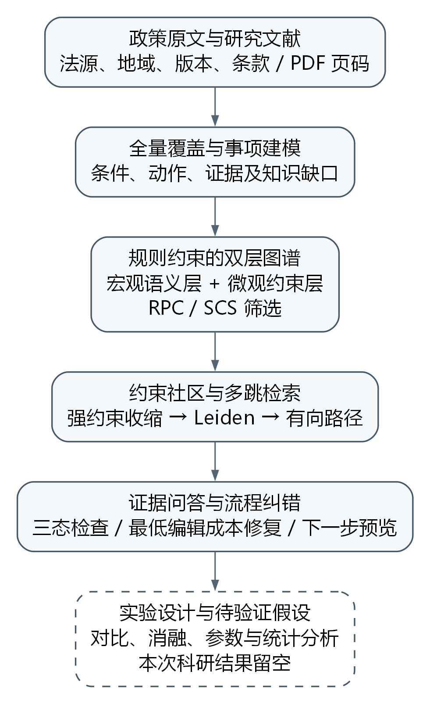
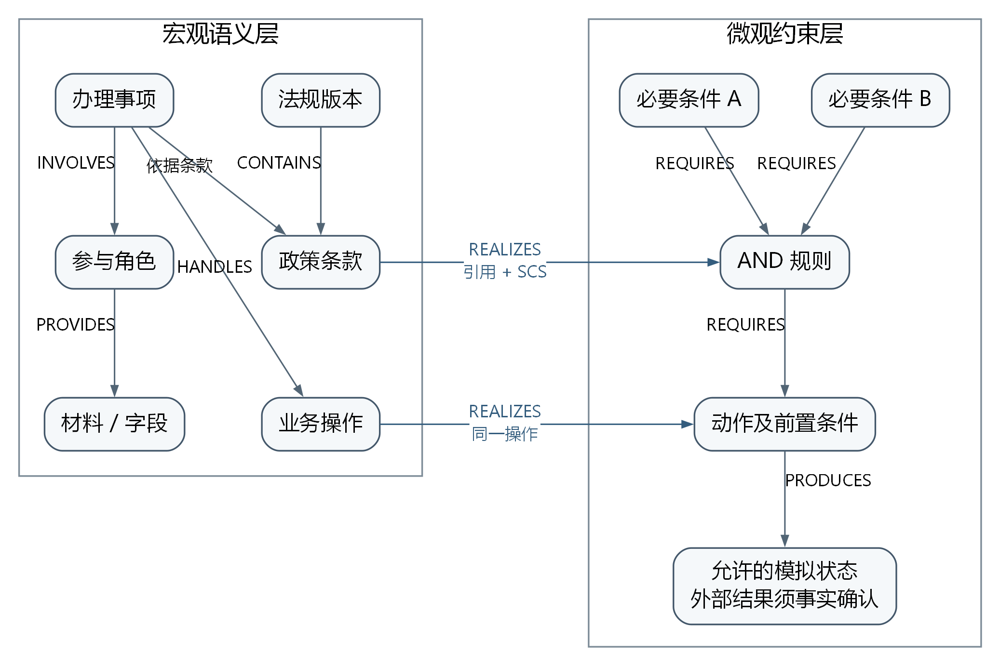
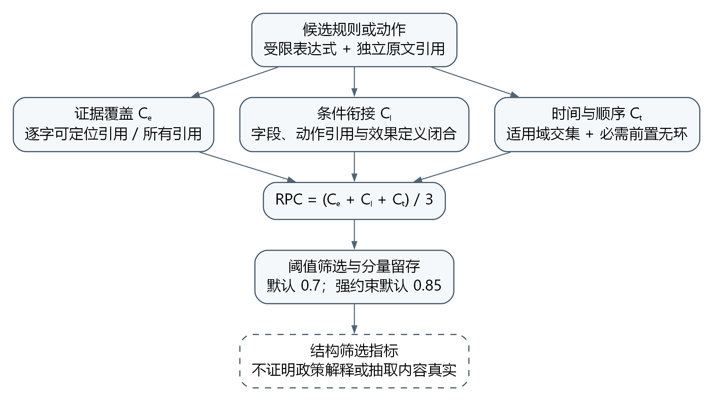
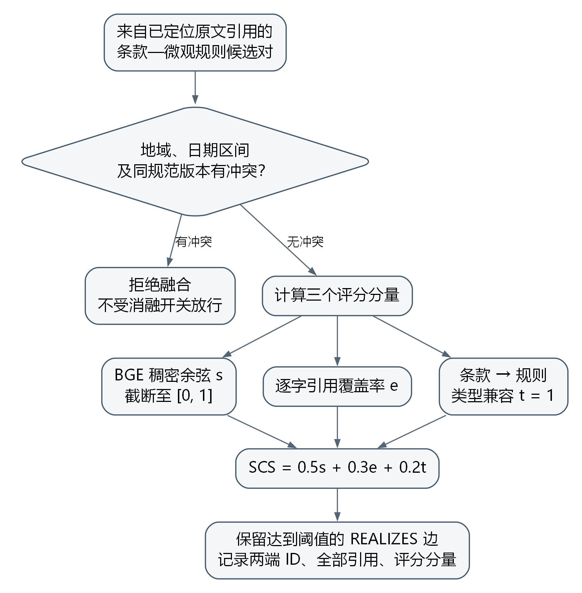
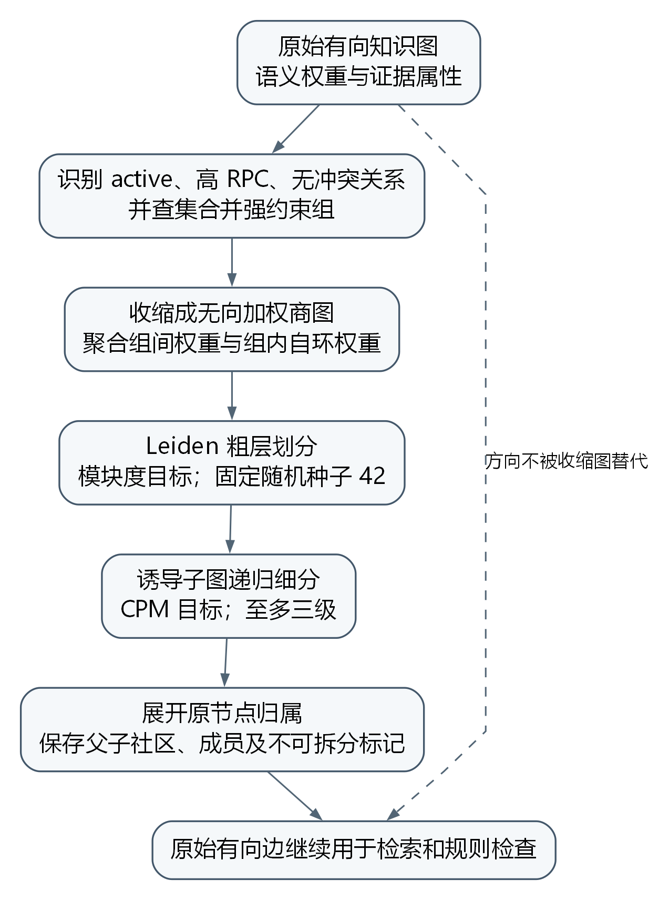
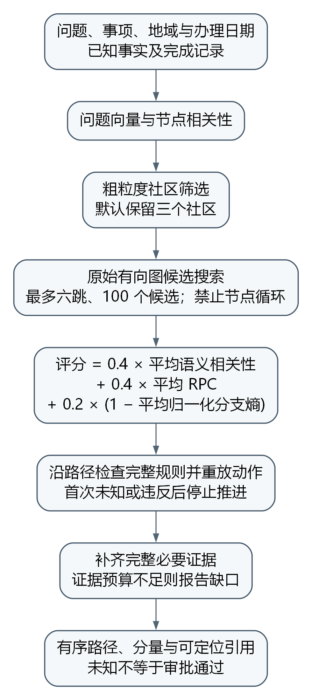
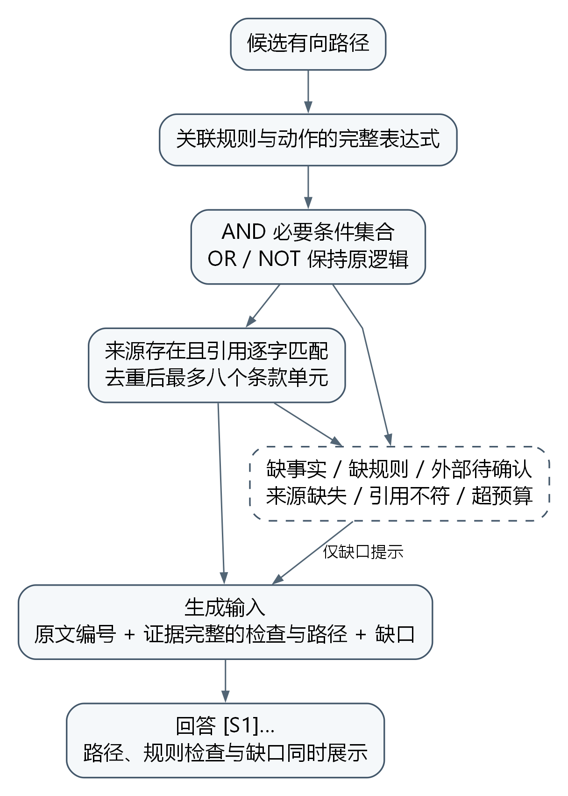
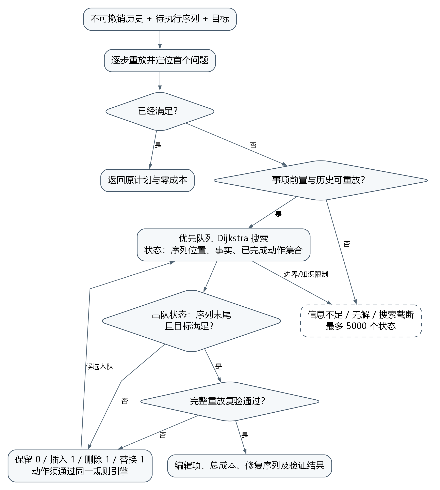
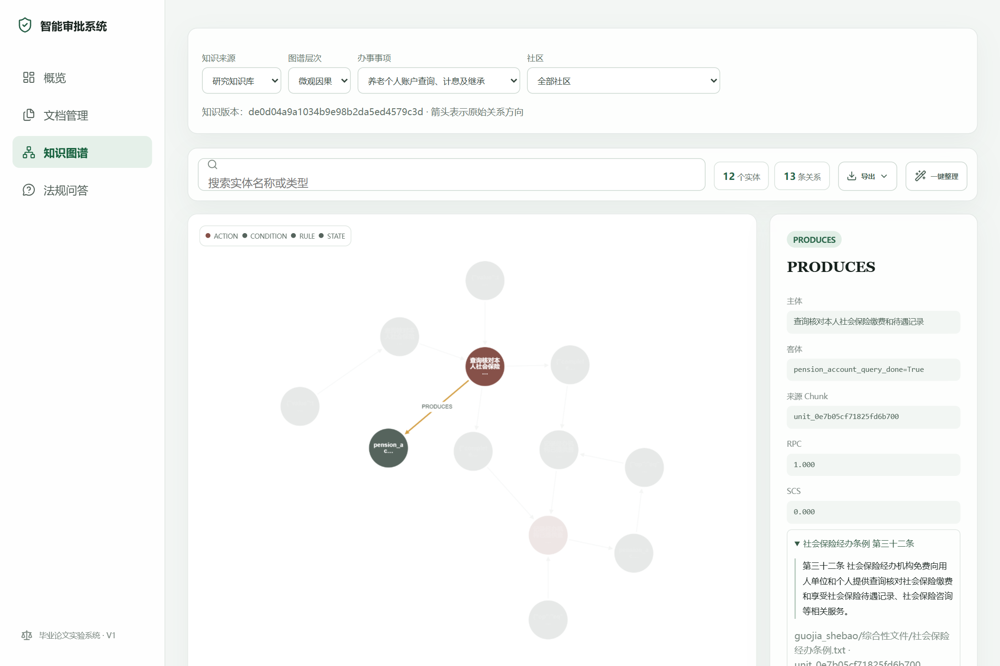

# 摘要

社会保险与住房公积金办理涉及多来源政策、地域差异、时效条件和跨条款流程依赖。通用检索增强生成系统能够为问题寻找相关文本，但文本相关性不足以说明审批条件是否满足，普通图谱中的连接关系也不能直接证明步骤顺序合理。当申请材料不完整、政策参数缺失或外部结果尚未确认时，仅依靠自然语言生成容易混淆办理建议与确定性判断。针对这些问题，本文围绕规则约束、方向依赖和证据组织，研究智能审批辅助系统的关键技术。

首先，提出规则约束的双层知识表示方法，在宏观层组织事项、规范、条款、角色、材料和操作，在微观层表达条件、动作、结果状态与例外。通过受限JSON表达式和三态逻辑保留条件结构，区分申请人事实、政策参数及外部核验结果，并使用原文引用与版本标识实现追溯。在此基础上，定义RPC与SCS筛选指标，分别度量证据覆盖、表达式衔接、时间顺序相容以及跨层连接的语义和来源支撑。

其次，设计约束保持的社区与多跳检索方法。对经过审核、高置信且无冲突的强依赖组进行收缩，在加权图上调用Leiden算法形成社区，再展开原始节点归属。有向检索保留原图的前置与产出关系，结合语义相关性、RPC和归一化分支熵排序候选路径，并补齐AND条件所需的证据。本文所称因果增强主要指有原文支撑的规范性方向依赖，不估计现实中的干预效应，也不把评分解释为已校准的因果概率。

最后，构建证据问答、流程检查和编辑修复的交互闭环。系统逐步重放办理计划，定位首个不满足或未知的步骤；在保持不可变事实与既有历史的条件下，使用包含序列位置的状态空间搜索寻找声明成本下的修复方案，并对结果完整重放验证。原型基于Windows环境实现前后端联动，保留基础检索模式、知识版本和研究配置，按条款公开事项支持范围与资料缺口。

本文以36份政策和8篇研究文献组织研究资料，建立后续对比、消融、参数与误差分析的实验协议。本初稿不预填科研实验结果，方法效果及相应统计结论留待按照实验协议完成验证。

**关键词：** 智能审批；检索增强生成；知识图谱；规则约束；流程修复

# Abstract

Social insurance and housing provident fund services involve policies from multiple sources, jurisdictional and temporal conditions, and procedural dependencies distributed across provisions. Retrieval-augmented generation can locate relevant text, but relevance alone does not establish eligibility or procedural validity. This thesis studies rule-constrained and causally enhanced methods for an evidence-based approval assistance system.

A dual-layer knowledge representation organizes matters, regulations, provisions, roles, materials, and operations at the macro level, while representing conditions, actions, states, and exceptions at the micro level. A restricted JSON expression language and three-valued evaluation distinguish satisfied, violated, and unknown conditions. Applicant facts, policy parameters, and externally confirmed results have separate semantics. Two implementation-specific indicators, RPC and SCS, support structural consistency screening and cross-layer alignment while retaining locatable source evidence.

A constraint-preserving retrieval method contracts reviewed, high-confidence dependency groups before applying Leiden community detection and subsequently restores original node membership. Directed candidate paths are ranked using semantic relevance, RPC, and normalized branching entropy. Necessary evidence is completed for conjunctive conditions. Causal enhancement here refers to source-supported normative dependencies and state transitions; it does not identify real-world intervention effects or calibrated causal probabilities.

The prototype combines evidence-grounded question answering with ordered workflow replay, bounded sequence repair, and next-action previews. Repair preserves immutable facts and completed history and minimizes the declared edit cost within the specified action space and search boundary. The Windows implementation retains baseline retrieval modes, versioned knowledge snapshots, configuration records, and explicit capability gaps. The study organizes 36 policy documents and eight research publications and specifies subsequent comparative, ablation, parameter, and error-analysis experiments. Research results and empirical conclusions are intentionally left unfilled in this draft.

**Keywords:** approval assistance; retrieval-augmented generation; knowledge graph; rule constraints; workflow repair

# 第1章 绪论

## 1.1 研究背景与意义

### 1.1.1 研究背景

社会保险与住房公积金服务连接个人劳动就业、家庭生活和公共服务管理。围绕参保缴费、待遇申领、关系转移、资格确认和贷款提取等事项，申请人需要同时理解办理对象、条件、材料、程序和适用期限。相关知识并不集中在一份完整的操作手册中，而是分散于国家层面的法律法规、地方实施办法、阶段性通知以及具体经办规范。同一事项的基本条件和补充条件可能出现在不同文件，后续文件还可能调整原有口径。对知识服务系统而言，正确找到一个包含关键词的段落，只是回答办理问题的起点。

数字化转型改变了公共服务信息的传播方式，也使知识组织和业务解释的重要性更加突出。陈斌从制度适应性角度讨论了数字化转型对社会保障体系的影响，指出制度、技术与人力资本之间需要协同演进；本文据其转载摘要引用这一背景论述[1]。这一研究为本文选择应用场景提供了背景，但并不能直接推出采用某种问答算法必然提升服务质量。本文关注的具体技术问题是：面对有限且可追溯的政策资料，系统怎样识别适用条件，怎样解释跨条款的办理依赖，以及怎样在信息不足时给出有边界的辅助建议。

社会保障领域的研究也提示，知识服务必须置于具体制度情境中。席恒从中国社会结构与制度实践出发讨论自主知识体系的理论构建[2]；杨俊反思职工养老保险“统账结合”的建制理念与现实困境[3]，周佩则围绕公平、效率和可持续性组织职工养老保险高质量发展的分析框架[4]。这些讨论支持本文保留业务概念和制度层次，而非将所有政策内容视为可互换的语句。

制度差异与参数口径同样需要明确。尹成远、仲伟东研究城乡居民养老保险运行效率的省域差异[5]；李保华、伊辉从政策碎片化视角分析职工社保与企业劳动力市场势力之间的联系[6]。何文炯提出精算不仅是技术，还应形成制度设计、筹资与支付分析等工作规范[7]；戚昌厚等讨论再分配效应测量方法不一致所引起的结论分歧[8]。本文据此重视地域、时间、参数和评价口径的可追溯性，但不把上述经验研究结论或改革建议直接转写为审批规则。

大语言模型能够理解自然语言问题并组织流畅回答，为政策咨询提供了新的交互方式。然而，模型参数中的知识无法直接说明某个判断依据的是哪一版政策、某一条款是否适用于用户所在地区、模型是否遗漏了例外条件。将模型直接用于办理建议，可能出现“语言上完整、依据上不完整”的回答。例如，系统列出了申请步骤，却没有检查用户是否已经满足前置条件；系统给出了材料清单，却没有区分本人可准备的材料与必须由外部机构作出的认定。此类问题难以仅用回答的通顺程度评价。

检索增强生成通过引入外部资料，为模型回答提供了可更新的上下文。但政策知识具有显著的关系性：材料是某项申请的输入，确认行为是后续办理的前置步骤，例外条款会改变一般条件的适用范围。单纯按文本相似度检索，容易优先选中措辞相近的段落，而错过表达不同但具有决定作用的约束。将这些关系组织为知识图谱，有助于提供跨片段连接；进一步把部分条件写成可执行表达式，才能对特定事实进行稳定检查。由此，文本、图结构和符号规则之间的衔接成为本研究的出发点。

本文使用项目中提供的三类原始资料开展系统设计。其中，政策材料包括国家与地方层面的三十六份文档，覆盖养老、医疗、失业、工伤、生育和住房公积金等领域；另有八份研究文献用于理解制度背景与学术语境。这里的“覆盖”首先指资料和事项进入知识目录，而不意味着每个事项均已具备完整可执行流程。原材料存在引用外部办法、缺少操作步骤、适用期限需要核对以及结果依赖经办机构决定等情况。系统应显式保留这些不足，使用户能够区分已知条件、待补信息和无法由本系统模拟的环节。

### 1.1.2 研究意义

在知识表示层面，本文尝试同时保留政策文本的语义联系和办理条件的形式化含义。宏观图层用于描述文档、条款、事项和相关概念之间的联系，微观图层用于描述字段、规则、动作及其依赖。二者通过原文证据关联，使一条图边不仅能够用于检索，也能够回溯到对应条款。当某个条件被表示为可执行规则时，还需要明确字段类型、事实来源与适用域，防止把一个概念关联误当成申请资格判断。该组织方式为复杂政策知识从可读到可查、从可查到可检验的转换提供了研究对象。

在推理与解释层面，本文将回答依据与执行条件分开处理。自然语言回答负责解释政策含义，规则检查负责判断已提供事实是否满足形式化条件，流程模块负责推演允许的状态变化。对于缺失信息，系统返回未知状态及待补字段；对于明确违反的条件，系统给出规则和原文依据；对于只有外部机构能够确认的结果，系统保留外部确认要求。这样可以把一个笼统的“能否办理”问题细化为可核对的判断链，而不将不确定性隐藏在自然语言表达中。

在工程应用层面，研究成果以现有前后端演示系统为载体。除了问答结果，系统还展示原始文档、条款覆盖、规则审核、社区路径与流程状态。候选规则经核对后可以批量启用，停用或移除知识来源后相关内容需要同步失效。上述功能使方法具备可观察的输入输出，也为后续实验提供记录接口。需要强调的是，工程实现完成与学术效果成立是不同命题；本文初稿不以页面可用或单元测试通过替代对比实验，而是在第六章给出待执行的验证方案。

## 1.2 国内外研究现状

### 1.2.1 检索增强生成与政策知识服务

Lewis 等提出的检索增强生成模型将参数化生成模型与非参数化外部记忆结合，为知识密集型任务提供了可检索的信息来源[9]。Karpukhin 等研究了使用稠密表示进行开放域段落检索的方法，为问句和文档之间的语义匹配提供了基础[10]。这类研究说明，回答生成与外部知识访问可以组成联合过程。本文沿用这一基本思想，在固定资料库中检索证据，再通过模型组织答案，而不将模型内部记忆视为独立的政策依据。

将这一思路应用于政策资料时，检索对象的定义会直接影响回答边界。过大的片段可能包含多个事项，造成条件混杂；过小的片段可能截断一个完整的例外结构。政策条文还具有标题、层级、发布机关、适用地区和有效期等上下文，若分块仅保留正文而丢失这些信息，就难以判断两个相似片段究竟是互相补充还是分别适用于不同人群。因此，政策问答中的检索质量不能只用语义接近程度表示，还需要考察证据单元是否完整、来源是否可追踪以及适用域是否匹配。

本文现有工程保留了上传文档库和研究资料库两种入口。前者支持原演示流程，后者承载提供的政策数据及结构化规则。它们是不同的语料范围，不能因为使用了相同的“向量检索”标签就直接进行性能比较。正式研究应在同一研究语料上比较向量检索、普通图扩展和规则因果增强模式，并控制相同的生成模型、问题集与上下文预算。由此，模式差异才能尽量对应知识组织与推理机制，而不是资料数量差异。

### 1.2.2 知识图谱、社区组织与多跳检索

知识图谱可以把文本中分散出现的对象和关系转换为可遍历结构。相较于孤立片段列表，图结构能够表示某个事项关联哪些材料、某个动作依赖哪些先前动作，并将跨文档的证据组织为路径。然而，图中存在边并不意味着该边具有可执行含义。“涉及”“说明”与“必须先完成”承担不同作用，若统一当作无向关联进行扩展，系统可能获得相关材料，却无法据此证明一段办理顺序合法。因此，有向关系类型和证据支撑是本文对普通图检索进行扩展的重要基础。

Edge 等提出 Graph RAG，通过构建实体图并生成社区摘要，支持面向整个语料的综合性问题[11]。该工作强调了图组织与社区摘要对全局信息整合的作用。本文的主要问题则更接近给定事项和事实条件下的具体办理辅助：不仅需要相关信息，还需要知道某条依赖在当前情境中能否成立。基于这一任务差别，本文将 GraphRAG 作为相关研究和可能的外部对照，而不会把项目中的普通图扩展自动命名为其完整复现。

社区发现为大图的分层组织提供了工具。Traag 等提出 Leiden 算法，通过局部移动、划分细化和图聚合改善社区连通性质[12]。社区在统计结构上连通，仍不等于社区内部规则在业务上兼容。以政策知识为例，两个节点可能因共享大量词语而相近，却属于不同适用版本；一个办理链也可能横跨语义主题，使无约束划分将关键依赖拆散。本文研究如何在社区与路径构建中加入适用域、规则方向和强依赖约束，并同时观察结构指标与任务指标，避免只优化图形外观或单一模块度。

### 1.2.3 符号规则、状态规划与反事实解释

符号规则将判断条件显式写为表达式，适合表示阈值比较、条件组合、集合关系和动作前置依赖。其优势在于相同输入可以得到一致的检查结果，并能够定位被使用的条件；其限制在于规则编写需要明确字段含义，原文中的省略、例外、交叉引用和裁量空间不能自然地消失。对于本文语料，不完整的条款不能被简单补成恒真条件，否则系统形式上可以执行，语义上却已经越过证据边界。

从规划角度看，办理过程可以描述为状态和动作序列。STRIPS 研究将动作的前置条件与效果用于问题求解，为状态空间中的计划表示提供了经典基础[13]。本文借鉴这种表示方式，将申请人可操作步骤和外部确认步骤分开，并将已经完成的历史作为不可撤销约束。用户提交的拟执行序列可能存在缺少前置步骤、次序错误或目标不匹配，因此需要在保留历史与事实的前提下寻找可执行的替代序列。

反事实解释研究关注改变输入条件后决策结果会如何变化[14]。不过，距离较近的输入变化未必现实可行，修改年龄、抹去办理历史或假设审批已经通过，都不应成为流程修复方案。本文将反事实限定在声明的规则与动作模型之内，解释“在当前模型中采用另一条允许的计划会得到什么状态”。该限定与基于观测数据识别现实因果效应有本质区别；本文不据文本条件估计干预效果，也不主张从政策资料中学习出了现实世界的完整因果机制[15]。

### 1.2.4 现有研究对本文的启示

上述研究分别提供了知识访问、图组织、规则执行和状态推演的技术基础，但将它们连接为政策辅助办理系统，仍需要解决对象语义、证据粒度和不确定性表达的一致性问题。一个检索到的条款怎样进入规则审核，一条启用规则怎样参与图边过滤，一条证据路径怎样支持答案而不替代执行检查，以及一个修复计划怎样反馈到界面中的事实状态，均需要明确定义。本文围绕这些接口展开研究，并通过模块对照和系统案例检查连接是否产生可验证的效果。

## 1.3 研究问题与主要内容

本文首先研究如何从多源政策材料构建证据可追溯的双层知识表示。原始文件只是存储单位，实际语义单位应细化到独立规范与条款。一个文件可能同时包含修订通知和原有办法，同名条号也可能出现在不同法规中。因此，本文在解析阶段保留稳定标识与来源路径，在事项层面建立覆盖记录，在规则层面保存表达式、适用域、审核状态和原文引用。宏观关系用于关联上下文，微观规则用于检查具体条件，二者通过支持关系形成融合图。

第二个问题是如何在相关性检索中保持方向依赖和适用边界。本文将事项、地域和日期纳入查询情境，并在社区组织与多跳候选生成阶段利用规则支持。候选路径除了语义得分，还保留涉及的节点、边、规则和证据，以便检查排序结果究竟反映了什么。研究不预设更长的路径一定更好，而是关注有限上下文预算下能否找到足以支持回答的完整链条。路径评分中的结构项属于方法设计，其实际贡献需要通过消融实验确认。

第三个问题是如何把回答扩展为可检查的办理辅助。本文将自然语言问题与结构化表单结合：问答部分解释资料，流程部分接收明确事实与拟执行步骤。系统先检查条件和步骤，报告首个错误、缺失字段和知识缺口，再提供受约束修复或下一步候选。候选动作仅在预览后由用户应用到当前模拟，外部机构结果仍需明确确认。对于缺少动作模型或无法满足目标的事项，系统展示对应能力边界，而不通过生成文本填补一个虚构的办理闭环。

围绕三个问题，本文的主要内容包括条款级语料解析、全量事项目录、候选规则抽取与审核、双层图谱构建、约束社区、多跳证据路径、三态规则判断、流程首错定位、计划修复、下一步模拟及前后端实现。初始规则包的来源标记为实现者对照原文核对，不描述为已完成专家审定；模型新生成的规则均作为候选进入审核。研究结果的可靠性由原文追溯、表达式校验和后续独立标注实验共同评估，而不是由模型输出置信措辞决定。

## 1.4 技术路线与拟验证创新点

本文的技术路线从资料治理开始。首先解析全部政策与文献，记录文件指纹、独立法规和条款单元，将办理相关内容映射到事项，同时说明未映射内容的排除原因。其次构建宏观关系和微观规则，结合规则一致性与跨层支持形成双层图谱；模型候选经过结构校验和来源核对后才可启用。随后，在查询情境下选取社区与有向路径，进行条件过滤和证据组织。最后，将证据提供给回答生成模块，并由规则引擎与流程模块完成独立的检查和模拟。

{width=15cm}

本文拟验证的第一个创新点，是将政策条款的宏观语义联系与微观可执行条件放在同一证据框架中，利用一致性和支持关系控制跨层连接。该设计的研究价值需要体现在抽取准确性、证据覆盖或规则使用方面，不能仅以图层数量作为创新依据。第二个拟验证点，是在社区与路径检索中结合适用域、方向依赖和规则状态，考察对完整证据链检索的影响。第三个拟验证点，是把规则判断、首错定位、受约束计划修复和下一步预览连成可解释交互过程，考察其合法性与使用成本。

上述创新点均按问题、机制和评价指标对应组织。若某项组件未带来预期变化，应根据实际记录分析它适用的条件与代价，而不修改实验口径以制造优势。尤其是流程修复的“最小”需要限定搜索空间与编辑代价，搜索被截断时只报告当前状态，不宣称已经找到全局最优方案。本文初稿完成的是方法描述与实验协议；关于准确率、时延以及相对改进的判断，留待正式实验后补充。

## 1.5 论文组织结构

全文分为七章。第一章介绍研究背景、相关研究、研究问题与技术路线。第二章给出政策辅助办理任务的形式化定义，说明检索增强生成、双层图谱、社区、三值逻辑和状态空间修复的基础。第三章介绍条款解析、事项建模、候选规则审核及双层图谱构建方法。第四章介绍约束社区组织、多跳路径生成与联合排序。第五章介绍问答、规则检查、流程修复、下一步推荐及系统实现。第六章提出图谱、检索、问答和流程任务的对比消融方案，结果位置暂留空。第七章总结完成的工作，讨论资料覆盖、模型边界和后续验证方向。

本文初稿中的系统能力描述以代码实现为依据，实验分析采用待验证假设和填充模板。政策原文、研究文献、结构化规则及用户输入分别承担不同证据角色；后续各章遵循这一划分，避免将学术背景转为执行依据，或将演示流程误写成真实业务决策。

# 第2章 相关理论与问题定义

## 2.1 政策辅助办理任务定义

本文研究的输入不是一个脱离情境的问句，而是问题、事项、适用地域、适用日期、事实与办理历史的组合。设问题为 q，所选事项为 m，地域为 r，日期为 t，申请人提供并确认的事实为 F，已完成历史为 H，拟执行步骤为 π。完整任务情境记为 X=(q,m,r,t,F,H,π)。对于仅查询政策含义的问题，可以不提供具体事项和事实；对于流程检查和修复任务，则必须明确相应事项及其动作集合，否则系统无法判断某个步骤属于哪一套业务规则。

系统输出由解释和结构化结果两部分构成。解释部分包括自然语言答案及引用；结构化部分包括检索证据、规则检查状态、有向路径、缺失字段、知识缺口和可能的修复计划。两部分承担不同职责：答案可以帮助用户理解结果，不能改变规则检查已经确定的真假或未知状态；结构化结果可以约束生成内容，但也不能把未建模的现实条件推断为不存在。因此，输出的完整性应当理解为对已知范围和未知范围均有交代，而不是任何问题都给出肯定或否定结论。

设政策资料集为 D，解析后的条款单元集为 U。一个条款单元包含标识、所属文档、独立法规标题、条号、正文、地域和时间信息。文件与法规不是必然一一对应：同一个文件可能包含通知正文、附件办法和修订说明。若仅以文件名加条号生成标识，不同独立法规的“第一条”可能相互覆盖。本文因而将来源定位建立在独立单元标识和内容证据之上，并保留文档级指纹用于识别来源变化。

事项集合 M 用于把资料内容连接到可查询的服务目标。事项不仅包含名称，还包含字段、规则、动作、目标、来源单元和能力标志。可检索表示存在相关资料，可检查表示存在可执行条件，可模拟表示具有可用的状态转移，可修复表示能够在当前动作模型中搜索替代计划。这些能力之间并非简单的等级关系：某个事项可以有资格条件而没有完整步骤，也可以有办理顺序说明却缺少外部结果的自动确认方式。能力标志和缺口需要共同展示。

资料覆盖与流程可执行性采用不同的评价单位。覆盖记录回答某条款是否已映射到事项，或者为何被排除；流程检查回答给定事实和动作能否形成合法序列。不能由前者推出后者，也不能因为某事项无法闭环而将其从目录删除。该区别使全量材料的边界可以被观察，并为后续实验中的缺口样本提供明确标签。

## 2.2 文本表示与检索增强生成

### 2.2.1 条款分块与向量表示

文本分块的目标是在检索粒度与上下文完整性之间取得平衡。以条款为基本单元可以保留法规的层级定位，但一条较长条款仍可能需要划分为多个检索片段。片段应继承所属条款的标识和上下文，并保留能够回到完整原文的链接。对于包含“但书”、例外和列举条件的条款，分块边界不能使被检索的主体条件脱离其限制说明。实际解析若不能完全保证这一点，应由证据回溯步骤补充核对，而不把截断片段当成完整规范。

设编码器 E 将文本映射为 d 维向量，查询向量为 vq=E(q)，片段向量为 vu=E(u)。常用的余弦相似度为：

$$s_{sem}(q,u)=\frac{v_q^T v_u}{\|v_q\|_2\|v_u\|_2}.\tag{2-1}$$

该分值描述编码空间中的接近程度。它不直接表示条款是否有效，也不表示申请人已满足条件。以语义检索构造候选集后，仍需对地域、日期、事项和规则状态进行处理。Dense Passage Retrieval 使用稠密表示支持开放域检索，为这种向量候选生成提供了方法背景[10]；本文应用中的具体编码模型、切分参数和候选数量，则属于需要固定记录的工程配置。

### 2.2.2 检索与生成的接口

检索增强生成可概括为先获取证据集合 Z，再估计条件回答 y，即以 p(y|q,Z) 表示生成过程。在原始 RAG 研究中，外部记忆与参数化生成模型共同支持知识密集型任务[9]。本文采用的是给定语料上的检索与提示组装流程，不据此声称复现了原论文的联合训练设置。描述算法来源与描述系统实现时，应分别说明所借鉴的思想和实际执行的步骤。

证据进入提示前需要保持来源身份。相同条款被多个节点或路径访问时，应合并重复引用；不同版本具有相似正文时，不能因文本接近就合并为同一依据。对于一个由多条条件共同支持的结论，提示中应体现条件之间的关系，而不是把引用随机拼接成文本堆积。生成后还需要保留来源单元和路径标识，使回答中的关键判断可以回到原始证据，而不仅是展示几个无法对应具体结论的文档名称。

本文系统中的三种研究模式共享研究资料范围。向量模式主要使用文本相似度候选；普通图增强模式在相关文本或节点基础上进行一般关系扩展；规则因果增强模式进一步利用有向关系、适用域和规则检查组织证据。旧上传库仍提供兼容入口，但 dataset 的取值应随请求和会话保存。检索模式与语料选择是两个独立变量，将它们混为一谈会破坏后续对比实验的可解释性。

## 2.3 双层知识图谱与证据模型

### 2.3.1 宏观层、微观层与跨层支持

设宏观图为 GM=(VM,EM)，微观图为 Gμ=(Vμ,Eμ)，跨层连接为 EC，则融合图可记为 G=(VM∪Vμ,EM∪Eμ∪EC)。宏观层包含文档、条款、事项和相关概念，用于组织知识上下文；微观层包含条件、动作及结果等结构，用于表达可检查的依赖。图层区分表达用途，而不区分事实的真实性高低。宏观边仍需来源依据，微观边也仍可能处于候选状态。

边类型决定遍历的含义。例如，REQUIRES 表示前置要求，PRECEDES 表示顺序关系，PRODUCES 表示声明动作的效果，EXCEPTS 表示例外约束。关系名称必须与表达式语义相容，不能仅因句子包含“后”字就生成顺序边，也不能将一个 OR 条件拆成多条共同必要的 AND 条件。绘图时若将逻辑组合展平，用户可能误以为所有分支都必须满足，因此复合条件需要保留其组合结构或作为整体逻辑单元呈现。

跨层连接表达的是某个语义对象与规则对象之间存在证据支持，不表示二者完全等价。一个条款可能支撑多条不同条件，一条规则也可能需要多个条款共同解释。跨层评分可以综合语义接近、证据覆盖和类型相容等因素，但评分只能用于候选过滤与排序。低分支持边可能减少检索机会，高分支持边也不能跳过规则校验。本文第三章将结合实际实现说明 RPC 与 SCS 的具体定义及其参数，二者在本章仅作为一致性与支持评估的接口概念。

### 2.3.2 证据与规则生命周期

证据对象至少包含单元标识、来源路径、标题、条号与原文片段。证据有效性首先要求引用片段可以在对应原文单元中定位。这个条件能够发现部分生成性引用错误，但不能单独证明抽取结论正确：即使引用确实存在，模型仍可能误解量词、否定范围或适用对象。因此，证据定位、表达式结构校验和语义审核是不同检查环节，任何一个环节都不能替代其余环节。

规则的生命周期包括候选、启用、拒绝和停用。候选规则供审核查看，不参与正式可执行判断；启用规则进入条件检查和相关图结构；拒绝记录某次候选没有被采纳；停用用于保留历史但停止当前使用。初始规则包的核对来源和模型新增候选的来源应分别记录。模型抽取后即使通过 JSON 和引用校验，也只说明满足部分结构要求，不代表已经完成规范解释审核。

当来源文件变化或被移出知识库，关联规则、图边、社区与检索索引可能同时受影响。构建版本为这些对象提供共同的时间边界。一次问答或流程检查应记录使用的构建标识，使后续能够说明当时有哪些规则处于启用状态。否则，同一个问题在更新前后出现不同回答时，难以区分知识变动与算法不稳定。本文将这类可追溯性作为系统设计要求，而不把版本号本身视为效果指标。

## 2.4 社区组织与方向路径

### 2.4.1 社区结构与约束

图社区通常用于表示内部连接较密集、外部联系相对稀疏的节点集合。模块度是一类常用的结构评价量，在无向加权图的常见定义下为：

$$Q=\frac{1}{2w}\sum_{i,j}\left(A_{ij}-\gamma\frac{k_i k_j}{2w}\right)\mathbb{I}(c_i=c_j).\tag{2-2}$$

其中 A 为邻接权重，ki 为节点加权度，2w 为全图权重和，γ 为分辨率，ci 为社区归属。该公式用于说明结构目标，不能直接套用到任意有向多层图而不交代投影方式。正式实验比较社区时，需要固定图的输入版本、边权定义以及用于评价的无向投影，避免各方法在不同图上得到不可比的模块度。

Leiden 算法在局部移动之后引入划分细化，再基于细化结果进行聚合，并研究相应的连通保证[12]。这些性质不等同于政策逻辑的完整性。本文需要另外考虑强依赖是否被拆开、互不相容的适用域是否被混合，以及某个社区是否含有足以解释事项的条款。若硬约束使一组节点无法继续拆分，应如实保留不可拆分标识，而不是为了得到预定社区数量破坏约束。

层次社区可以分别提供粗粒度主题与细粒度事项上下文，但层次数量和分辨率仍需受数据规模约束。只有少量有效关系的子图可能没有适合继续划分的结构。重复把同一组节点复制为多个层级，会增加表示复杂度，却不产生新的知识组织信息。本文在后续实验中同时记录社区数量、大小分布、不可拆分比例以及检索效果，以区分形式上的层次与实际有用的层次。

### 2.4.2 多跳证据路径

一条有向路径定义为 p=(v0,e1,v1,…,eh,vh)，其中每条边的起终点必须与遍历方向一致，h 为跳数。路径用于连接问题相关节点与支撑结论的条件或条款。一般图上的可达性只说明存在连接，本文还需要检验边的证据、关系类型及适用范围。一条通过反向遍历前置边得到的路径，可能适合解释依赖来源，却不能直接作为正向执行顺序；检索路径和办理计划因此不能共用一个未经说明的“路径正确”标签。

路径排序可以综合语义相关性、规则支持、结构信息与长度代价。各评分项需要归一化到明确范围，说明高分对应的含义及不适用条件。特别是熵类指标只描述所定义分布的离散程度，不能自动解释成因果可信度；较高或较低的熵是否有利于当前任务，需要在具体定义和消融中检验。本文以可追踪的分项分数展示排序依据，不将加权和包装成概率意义上的正确率。

有限候选数与最大跳数使搜索能够在交互时间内结束，但也可能遗漏较远证据。系统返回截断标识时，含义是没有穷尽候选空间，而不是不存在其他路径。社区预筛选、证据预算与跳数限制共同决定召回范围，后续实验需分别记录它们，避免把搜索预算改变造成的效果误判为评分函数贡献。

## 2.5 三值逻辑与规则表达式

### 2.5.1 规则语法与类型

本文采用有限 JSON 表达式表示条件，包括常量、字段引用、比较、集合包含、布尔组合、有限算术与已完成动作引用。表达式解释器按声明操作符执行，不运行原文中的程序片段，也不将自然语言直接交给动态代码求值。对不存在的字段、未知操作符、非法结构和不合理的参数数量，校验阶段返回明确错误。字段类型包括布尔、数值、日期、枚举、文本与集合；布尔值不能隐式当作数值参与阈值运算。

规则可以写成 R=(id,m,φ,a,s,e,z)，其中 φ 为条件表达式，a 为关联动作，s 为地域和时间适用域，e 为证据集合，z 为审核状态。条件求值之前先判断适用域和启用状态。如果规则属于其他事项或已失效，则不能把它的真假用于当前结论；如果适用期缺少可靠信息，则需要报告资料缺口。规则不适用与规则被违反是两种不同情况，混淆二者会造成不必要拒绝或错误放行。

### 2.5.2 未知状态及组合语义

设真值域 T={T,F,U}，分别表示满足、违反和未知。字段不存在或值为 null 时，涉及该字段的原子判断为 U；明确提供 false 的布尔字段仍是已知值。对合取、析取和否定，采用强 Kleene 式组合语义：

表2-1 三值逻辑的合取与析取语义（交换对称项省略）。否定满足 ¬T=F、¬F=T、¬U=U。

| A | B | A∧B | A∨B |
| --- | --- | --- | --- |
| T | T | T | T |
| T | F | F | T |
| T | U | U | T |
| F | F | F | F |
| F | U | F | U |
| U | U | U | U |


这一语义允许已知的决定性条件主导组合结果。例如，若某规则要求 A 与 B 同时成立，而 A 已明确不成立，则即使 B 未知，整个合取仍为 F。相反，只因 B 没有填写而把它置为 F，会把“尚未提供证据”错误解释成“不满足条件”。在交互层面，未知布尔应提供独立的未填写状态；空数值不能被转换为零；用户没有勾选外部确认，也不等于外部机构已给出否定结论。

### 2.5.3 事实角色与检查解释

事实根据来源分为申请人事实、政策参数和外部事实。申请人事实描述个人或申请对象的属性，其中部分可在模拟中变化，部分应保持不变。政策参数由事项模型维护，前端不得用输入值覆盖。外部事实代表认定、审批或其他机构反馈，必须由明确确认的输入支持，系统不能通过一个模拟动作自行制造肯定结果。该区分将“可以填写”“可以推演”和“有权决定”三个问题分离。

每次规则检查除了输出状态，还输出被检查规则、缺失字段、原因及证据。对于结果为 U 的规则，应尽量指出需要补充什么信息；对于结果为 F 的规则，应指出实际比较或前置依赖中的冲突。解释不应越过表达式能够证明的范围。例如，未满足模型中的一个必要条件，只能说明当前形式化要求未满足，不能推断用户永远无法办理，也不能据此生成未在资料中记载的替代待遇。

## 2.6 状态空间、计划检查与修复

### 2.6.1 动作与状态转移

状态记为 S=(F,H)，包含事实映射和不可撤销历史。动作 a 由前置条件 pre(a)、声明效果 eff(a)、动作类型和证据组成。仅当 pre(a) 在当前状态中为 T，且动作符合事实角色限制时，才允许计算 S′=T(S,a)。若前置条件为 U，系统返回缺失信息；若为 F，则返回失败原因。STRIPS 的动作建模为这种表示提供了经典来源[13]，本文额外引入未知状态、外部确认及证据边界以适应政策资料的不完整性。

已完成历史与拟执行序列不能混合。历史 H 表示当前模拟明确承认已发生的步骤，计划 π 表示尚未应用的步骤。用户可以调整计划的顺序和内容，但不能通过修复模块删除历史中的不利记录。状态检查首先确认输入与历史是否自洽，再依序尝试计划中的动作，最后判断目标条件。首错因此可能位于初始条件、历史阶段、计划中的某一步或最终目标，界面应按阶段解释，而不把所有错误强行编号为计划第一步。

### 2.6.2 修复目标与最优性边界

给定原计划 π，修复寻找允许的计划 π′，使其在相同初始事实与历史下可执行并满足目标 g。设编辑操作集合包含声明的插入、删除、替换或次序调整，代价函数为 C，则问题可写为：

$$\pi^*=\arg\min_{\pi'\in\Pi_{allowed}} C(\pi,\pi')\quad s.t.\quad Valid(S,\pi')=T,\ Goal(T(S,\pi'))=T.\tag{2-3}$$

该式定义研究目标，并不自动证明实现能够求得全局最优。只有在允许空间、代价非负性、状态去重和搜索终止条件均明确时，才能讨论相应保证。实际交互需要限制展开状态数；触及上限时返回截断结果。未知条件阻止进一步判断时，应返回信息不足；完整搜索后仍无可行目标，才能在当前模型内报告不可达。三种结果不能统一显示为“没有方案”。

编辑距离还需要与业务含义协调。删除一个多余计划步骤与要求用户重新取得外部认定，并不具有自然相同的成本。本文采用的具体代价属于研究配置，初稿不将其描述为经用户偏好学习得到的真实负担。正式实验除了代价，还应分别统计编辑类型、步骤数量、外部确认需求和搜索开销，避免一个数值掩盖实际方案差异。

### 2.6.3 规则内反事实与下一步模拟

本文将反事实限定为固定规则模型内对允许计划的比较。它回答的是在已声明条件与动作效果下，采用另一个合法序列会得到什么状态。该过程不估计真实行政结果发生的概率，也不把政策条件视为通过观测数据识别的因果机制[15]。在解释层面，可改变性与可执行性约束比简单数值距离更重要；不可变事实、既往历史和外部审批结果不进入自动修改空间[14]。

下一步推荐以当前状态为起点检查候选动作，并给出状态、缺失信息和效果预览。预览是一种假设计算，不应立即写入当前模拟。用户点击应用后，系统才把被允许改变的字段更新并追加历史。对于已有计划，推荐当前下一步时不应先把整个计划悄悄执行一遍，否则推荐起点已经变化。该交互约定为后续首错定位、连续模拟和闭环案例提供了统一状态语义。

## 2.7 本章小结

本章给出了政策辅助办理任务的输入输出、条款与事项的区别、双层知识表示、检索与生成接口、社区和方向路径、三值规则及状态空间修复的基础。各对象通过来源证据和构建版本关联，但保持不同的判断职责。语义相近不等于条件满足，图可达不等于流程可执行，规则内模拟不等于现实因果识别。上述边界为第三至第五章的方法设计提供了统一术语，也为第六章分别评价知识质量、检索效果、判断正确性和计划合法性提供了依据。

# 第3章 规则约束的双层知识图谱构建

## 3.1 引言

政策辅助办理同时面对文本定位和条件执行问题。材料咨询需要有依据的清单，资格核查需要主体、经历、地域与业务日期，下一步查询需要已完成事项及后续前提。这些任务共享原始政策，却不能只用文本相似度解决。与“养老金申请”高度相关的文字，可能描述另一类主体，或只规定机关职责而未给出完整申请条件。

检索增强生成通过外部资料为回答提供可访问的知识来源，其基本思想为本文保留原文、检索后生成的处理流程提供了参考。[9] 本文进一步将政策文本组织为宏观关系与微观规则两种表示。宏观层回答知识属于哪份规范、哪个事项以及涉及什么信息；微观层回答某项条件如何判断、动作依赖什么前提以及能够改变哪些模拟状态。两层通过保留出处的关联连接，避免把文本共现直接当作可执行规则。

本章所称“因果”限定为规范前置依赖和已建模的状态转移方向。系统没有使用随机试验、观察数据识别或潜在结果模型估计现实因果效应，也不把机关最终决定视为语言模型能够推导的自然事实。图中的“产生”关系表示执行某个已定义动作后，局部模拟记录如何变化；它不表示现实机关已经受理、认定或发放待遇。该边界贯穿规则构建、评分和跨层融合。

## 3.2 多源政策解析与来源单元

### 3.2.1 原文保留与规范边界

知识构建首先区分物理文件与规范文件。一个文本文件可能同时保存管理办法、实施细则和发布说明，不同部分可以重新从“第一条”开始编号。若仅用文件名与条号建立标识，同一文件中的多个第一条会被覆盖。因此，解析过程先识别独立规范标题，再在各规范内部定位条、章以及办事流程的小节，将来源路径、内容摘要、规范次序和单元内容共同纳入标识生成。

文件标识由来源相对路径与文件内容摘要构成；条款单元标识进一步包含规范标题、规范位置及单元文本。这样的标识服务于版本追溯，而不是认定不同文件在法律意义上属于同一规范。原文发生修改后，新单元与旧单元具有不同的内容身份，旧规则不能仅凭相同条号继续沿用。对正文内部空格进行规范化只用于定位标题和日期，引用内容仍保留对应来源片段，不以重写后的摘要替换证据。

条款单元包括标题、条号或小节名、正文、所属文档、地域与时间属性。没有标准条号的办事指南仍可按明确的小节边界形成单元。发布说明和独立章节标题也被保留，其覆盖记录说明它们是否直接承载办理条件。由此，解析阶段不会为了提高可执行规则比例而丢弃难以建模的文本；后续构建可以区分“来源存在但尚未结构化”和“来源根本不存在”。

### 3.2.2 时间范围与研究资料边界

文件抓取时间、网页发布日期和规范施行日期具有不同含义。当前解析器依据正文中明确的施行表述识别起始日期，并在明确写出有效年限或截止日期时计算结束日期。只出现抓取时间不能据此填入施行日期。若正文给出了施行日但未规定终止日，库内时间范围可以采用开放的结束边界，同时保留“未核实后续修订与清理状态”的说明。这样的范围表示已入库文本的适用信息，不等同于对当前有效性的外部确认。

地域属性根据来源元信息形成全国、湖北或武汉等范围。本系统只实现研究资料所需的有限地域包含关系，并未维护全国行政区划及全部管辖规则。全国性规范与地方配套材料可以在地域上相容，但这一事实不能证明二者在效力层级上不存在冲突。对明确不重叠的地域或时间范围，后续融合应拒绝建立适用支持。缺少可解析适用日期或地域时，业务核查报告未知；已知开始日期、结束边界开放的规则可按库内范围核查，但始终不代表后续修订与现行有效性已获外部确认。

研究文献与政策来源分别进入语料对象。文献保存文件名称、页面和可提取文本，用于理论背景与基础检索，不生成 active 审批规则。无法提取文本的页面记录缺口，不能静默等同于空白内容。该划分防止检索系统把一篇讨论政策执行的研究论文误当作具体业务的行政依据，也使后续实验能够分别统计政策证据与背景文献的使用情况。

## 3.3 宏观知识关系构建

设宏观图为 \(G_M=(V_M,E_M)\)。节点集合包含政策文件、条款单元、事项、角色、信息或材料以及办理动作的宏观表示。文档到条款的 CONTAINS 关系记录来源组织；事项到条款的 GROUNDED_IN 关系记录事项依据；事项与角色、角色与信息、事项与动作之间的关系用于浏览和检索定位。此类边首先说明组织结构，不自动参与条件真假判定。

宏观角色由字段的 applicant、external 和 policy 角色属性导出。申请人角色对应个人或单位提供的信息，外部核验方对应需要现实业务系统确认的信息，政策参数单独标识为规范设定。字段的中文标签用于界面显示，稳定字段标识用于规则引用。系统没有从角色标签推断任意机构的法定权限，也没有以“外部核验方”这一概括名称代替原文中的具体经办机构。

材料节点的生成同样保持有限解释。当前实现根据结构化字段类型，将集合型或文本型信息作为材料或资料节点，将数值、布尔等字段主要作为概念信息展示。这是对现有目录的类型映射，不是一个已经训练并验证的材料实体识别模型。尤其不能因为年龄信息出现在申请表中，就把“年龄”宣称为一份需要单独提交的证明文件。需要提交哪些材料，仍以动作前置表达式和原文证据为准。

办理动作在宏观层表现为事项中的业务环节，在微观层表现为可检查前提和局部效果的执行对象。两者来自同一个动作目录条目，因此可建立身份对应关系。它不同于凭语义相近猜测出来的跨层匹配：宏观“提交申请”和微观动作标识一致时，关系成立的依据是目录身份，而不是向量相似度达到某个阈值。图中保留这一差别，便于解释不同跨层边的来源。

没有独立文本的宏观节点继承所引条款的证据及归一化均值向量。同源派生节点可能共享近似向量，因此后续查询仍需结合类型、事项归属和规则状态，不能只凭语义表示区分对象。

{width=15cm}

## 3.4 微观规则、动作与事实语义

### 3.4.1 受限表达式与三态求值

微观图记为 \(G_\mu=(V_\mu,E_\mu)\)，其主要节点包括规则、条件、动作和状态。规则条件使用受限 JSON 表达式表示，支持字段、常量、比较、集合包含、合取、析取、否定、前置动作完成检查以及有限算术运算。语法不包含任意程序执行、属性访问或外部函数调用。表达式验证器检查节点结构、操作符、参数数量与字段声明，并设置深度和节点数量上限，以便使非法输入在进入规则计算前被识别。

求值结果取 satisfied、violated 和 unknown 三种状态。缺少年龄不能转换为年龄不合格，缺少外部核定结果也不能转换为核定失败。合取中只要一个已知分量为假，整体可判为 violated；析取中只要一个已知分量为真，整体可判为 satisfied；其余涉及关键未知分量的情形保留 unknown。否定作用于逻辑状态，不能把“不知道是否满足”反转为“确定满足”。

比较采用明确的值类型。数字与数字比较，日期字符串在需要日期解释时进行合法性校验，字符串不能因为内容看起来像数值就自动进入数值比较。除零、非有限浮点结果以及非布尔条件结果返回未知原因。布尔值也不利用编程语言中与零或一相等的行为冒充数值。通过这些约束，系统把输入类型错误与业务条件不成立分开，避免在错误类型上产生确定的申请结论。

### 3.4.2 合取、析取与否定的图表示

对合取表达式，图构建器递归拆出必须同时成立的条件节点，并将它们的标识登记在所属规则或动作的 required_condition_ids 中。条件指向所属对象的 REQUIRES 边表示必要前提。保留完整表达式与独立条件标识的目的，是允许图检索展示局部关系，同时让规则引擎始终按完整逻辑求值。沿其中一个条件到达动作，只能说明发现了一项必要条件，不能据此认定全部申请要求已经满足。

析取与否定不按合取方式展开。一个包含“甲或乙”的表达式保留为整体条件，否则分别画出甲、乙到规则的必要边会错误表达为二者都必须成立。否定条件可用 EXCEPTS 边标识排除或否定约束，但其实际真假仍由完整 not 表达式决定。例如“尚未完成某动作”可以限制重复申请，不应转换为要求该动作先完成的顺序关系。

前置完成条件直接引用动作标识。只有明确的正向完成要求才形成 PRECEDES 方向边；否定或析取内部的引用不能直接升级为无条件的先后约束。已删除或未定义的前置动作是一项知识缺口，不能当作申请人漏做了一个仍然存在的步骤。这样既保留顺序信息，也避免把不完整目录包装成对申请人的违规判断。

### 3.4.3 动作效果与阶段性适用

动作由前置条件、效果映射、动作种类和原文证据构成。用户动作只能修改明确允许变化的申请人字段；政策参数来自事项目录，不能由请求事实覆盖；外部动作只能登记原始输入已经确认的外部事实。状态节点表示某个字段取值，PRODUCES 边表示目录定义的局部效果。系统不会通过“执行审批”这一模拟按钮制造批准、认定或到账事实。

资格规则还需要绑定正确的办理阶段。以准备材料和提交申请为例，年龄条件可能限制正式提交，却不应阻止整理已有材料。当前目录将相关资格规则绑定到真正受限的提交动作；需要用于独立事实核查的规则可标记 purpose 为 condition_check。公开的空步骤核查收集这类规则，实际流程仍按全局规则与当前动作规则执行。该处理没有提供绕过资格条件的开关。

若动作效果能够实际满足另一条件，构建器可连接相应状态节点与条件节点。连接依据是用动作效果对该条件求值得到 satisfied，而不是“已填表”和“提交材料”两个标签在文字上相似。此检查是局部值蕴含：它证明当前列出的效果足以满足该表达式，不证明现实办理已经发生，也不证明其他未列出的必要条件同时成立。

## 3.5 RPC 结构一致性约束

### 3.5.1 分量定义

RPC 用于检查规则或动作能否在当前结构中形成可解释的支持关系。它不是经过业务结果训练得到的成功概率。对对象 \(x\)，定义证据覆盖分量 \(C_e(x)\)、引用衔接分量 \(C_l(x)\) 和时序相容分量 \(C_t(x)\)，并采用当前实现中的等权平均：

\[
\operatorname{RPC}(x)=\frac{C_e(x)+C_l(x)+C_t(x)}{3}. \tag{3-1}
\]

其中，\(C_e\) 为通过逐字核对的引用条目数与对象声明引用条目数之比。引用必须具有存在的条款单元标识，quote 非空且确实包含在对应单元正文中。没有任何有效引用的规则不会因为另外两个分量较高而成为可执行支持。逐字核对解决“这段引文是否来自所指单元”的问题，不能独立证明引文已经充分表达该规则的法律含义。

\(C_l\) 是当前实现中的布尔结构检查量。它要求表达式满足受限语法、所引字段属于事项、所引前置动作存在且归属正确；当规则绑定动作时，还检查该动作前置表达式与效果字段的声明闭合。检查成功取一，否则取零。这里的“衔接”严格指 DSL 与引用闭合，不是对申请人事实真实性、自然语言条件抽取正确性或者动作效果现实可达性的统计估计。

\(C_t\) 检查参与关系的作用域是否存在明确冲突，以及正向动作依赖是否形成循环。构建器读取规则、证据与有关前置动作的已知时间边界，检查是否可以相容；对正向完成依赖建立有向关系并识别强连通分量，循环参与对象不能获得完整的时序相容分量。只因一条规则位于历史年份，并不会使该分量自动为零，因为历史资料仍可以用于解释历史业务。

### 3.5.2 结构时间与业务时间的区别

结构时间相容与业务日期适用是两个不同层面的问题。前者考察两条知识能否合理地被放进同一支持关系，后者考察某一具体请求日期是否落在规则已知范围内。图构建没有把运行当天作为所有资料的筛选日期。否则，系统会丢失历史版本的可解释性，也无法回答过去某日申请应依据哪一版本的规则。

对于缺少终止日期的材料，结构检查只能说未发现明确的区间冲突，不能说其现行有效性已被证实。版本检查仅比较同标题、同地域的规范；不同规范的文号本来就可能不同，不能以字符串不同替代冲突判断。缺少规范身份或版本信息时，version_check 保留 unknown，不伪造冲突，也不宣称版本一致。

正向环路可能源于定义错误，也可能涉及尚未建模的重复补正。当前实现保守降低其结构支持，不把环路自动解释为法律禁止，也没有建立可处理任意循环的过程模型。

### 3.5.3 阈值与解释信息

默认 RPC 阈值为零点七，可拒绝明显缺乏结构闭合或时序相容的对象，但达到阈值不等于通过专家审查。它是尚未实验调优的工程参数，后续须同时观察错误关系保留与正确关系误删，不能只报告生成边数。

规则、动作和因果边保留 rpc_components。引用完整但字段未声明时，解释指向引用衔接失败，而非笼统的“模型置信度低”。移除 RPC 的配置取消相关筛选与路径评分项，仍可保留分量和审核状态用于追溯。

{width=15cm}

## 3.6 SCS 跨层支持评分与融合

### 3.6.1 稠密语义表示

本文采用配置中的 BGE M3 模型生成文本向量。该模型研究覆盖多语言和不同粒度的检索表示，但本系统实际调用的是稠密向量编码，没有同时实现其稀疏检索和多向量检索分支。[16] 编码接口对向量进行归一化，因此条款与规则文本的点积可以作为余弦相似度使用。规则文本由规则标签与引文组成，条款文本由标题与正文组成。

相似度用于衡量文本表示接近程度，不能解释为条款支持规则的概率。两段都含有“住房公积金”的文字可能属于不同业务和地域，仍然获得较高相似度；反之，一条简短的前置条件与一整条冗长程序规定也可能因长度与信息密度差异得到较低相似度。因此，语义分量需要与出处支持和范围相容检查结合，而不能独自承担规则启用决定。

### 3.6.2 跨层评分及硬拒绝

对条款单元 \(u\) 与规则 \(r\)，当前跨层支持评分定义为：

\[
\operatorname{SCS}(u,r)=\mathbf{1}_{\mathrm{compatible}(u,r)}
\left(0.5S_{ur}+0.3C_e(r)+0.2T_{ur}\right). \tag{3-2}
\]

\(S_{ur}\) 是截断到零至一范围的实际语义相似度；\(C_e(r)\) 沿用已核对引用覆盖比例；\(T_{ur}\) 表示类型对应。在当前仅对“条款实现规则”这一已知候选类型评分的实现中，类型分量取一，并不是额外训练得到的类型分类器。地域、时间及可比版本存在明确冲突时，兼容指示量为零，并拒绝对应跨层融合。

默认 SCS 阈值同样为零点七。没有获得语义向量时，语义分量取零，而不回退为证据覆盖率或人为满分。例如，引用覆盖和类型对应均成立但语义值缺失时，总分只有零点五，完整配置不会因此生成同等强度的语义跨层支持。移除 SCS 的配置取消阈值筛选，仍不能放行已经确认不相容的作用域关系。阈值消融与业务冲突约束由此保持区别。

同一目录动作的宏观与微观表示采用身份对应，不混入上述语义匹配的缺省规则。这样的跨层边可以保留 identity 分量，说明其依据是同一个动作对象。另一方面，基于实际相似度建立的跨层边保留 semantic_weight，社区划分时可以读取真实语义权重，而不把所有跨层关系都赋成一。两类来源在同一图中共存，但解释与权重来源不同。

### 3.6.3 融合结果与证据去重

融合图定义为 \(G_F=(V_M\cup V_\mu,E_M\cup E_\mu\cup E_X)\)，其中 \(E_X\) 为保留来源的跨层关联。节点类型和层属性始终保留；显示时选择宏观层或微观层，只截取相应节点及两端仍存在的边，不修改原始规则语义。边标识由源节点、目标节点、关系类型和关联规则身份生成，重复建立同一关系时合并证据，避免重复边改变社区权重和界面统计。

引文去重同时考虑来源身份和实际内容，不能因两个句子相同就丢掉不同出处。图构建保留证据，检索阶段再按预算选择必要来源。

{width=15cm}

## 3.7 审核状态与知识更新

规则状态区分 candidate、active、rejected 和 disabled。初始可执行规则来自实现阶段对所列来源的人工核对，review_source 如实记录该过程，不标称为经过独立领域专家审查。新提取或待补充的规则保持候选状态；只有语法和出处检查通过并完成明确审核操作，才进入启用状态。缺少可执行条件的来源记录可以用于目录与缺口展示，但不能用常量真替代尚未获得的规则。

停用与拒绝具有不同执行含义。停用必要规则表明现有动作支持被撤回，相关动作不能仅凭一条不相关的全局规则继续被视为可执行。拒绝某个尚未成立的候选规则，不应否定同一动作仍然保留的有效支持；但若动作已没有启用的专属支持，也需要报告知识缺口。图中的执行边与流程规则使用同一状态语义，避免审核界面显示“停用”而路径检索继续使用旧依赖。

来源变化和审核操作可能同时影响规则、动作、跨层边与社区，不能只删除节点而复用旧路径。构建快照保存语料与配置身份，运行记录引用构建标识；数据库发布的并发正确性还需系统验证，不能由快照文件的存在直接推出。

## 3.8 覆盖清单、能力分级与方法边界

每个政策单元都应有映射或排除记录。映射记录说明该条款与哪些事项有关；排除记录说明其作为发布说明、独立标题或其他非办理内容被保留的原因。这里的“覆盖”是来源管理意义上的覆盖，不是已经证明所有条款都完成可执行抽取。系统同时记录单元是否结构化及关联规则，允许从事项反查未建模的来源，避免用少数可运行案例代表全部语料。

事项能力分为可检索、可核查、可模拟和可修复。只有文本来源的事项仍可提供定位和说明；存在已核对条件时可以执行局部事实检查；存在动作、前置和效果时才具备相应模拟条件。能力标志还应结合当前规则状态、作用域与事实完整性解释。一个事项有动作目录，不意味着对任何日期、任何输入都能得到完整修复方案，更不意味着系统能够生成现实审批结论。

本章主要控制结构错误和证据脱离。未覆盖的例外、库外年度标准、未确认的后续修订及材料核验层级仍需要保留缺口。提高规则包的语义完整性，有赖于逐条核验、代表性业务案例和独立标注，不能由结构分数代替。

## 3.9 本章小结

本章构建了保留出处、类型和方向的双层图谱。宏观关系组织事项与来源，微观结构表达条件和动作；RPC 检查结构支持，SCS 引入实际语义相似度。审核状态、覆盖记录和版本边界共同限制知识使用，为社区组织与有向检索提供输入。

# 第4章 约束社区与多跳路径检索

## 4.1 引言

双层图谱将条款出处、事项关系和可执行条件组织在同一知识结构中，但图中存在关系并不意味着查询可以直接使用该关系。用户通常只提出一个具体问题，既没有给出全部事实，也不会逐项列出所需条款。若从全图任意扩展路径，容易引入相似主题下的其他参保身份、其他办理阶段或不同时间版本；若只截取最相似的一个节点，又可能漏掉同一动作的其他必要条件。本章研究如何在有限检索预算下组织图空间，并将路径、规则结果和来源证据共同交给生成模块。

这里区分三种判断：社区判断哪些知识适合共同组织，路径判断哪些关系可以按已有方向相连，规则判断当前输入是否满足完整条件。社区的内部连接较强不能推出其中规则都适用于用户，路径能够连通也不能推出申请目标已经达到。本文将社区作为候选空间，将路径作为解释性证据载体，将三态规则结果作为事实核查信息，以避免用一种图指标代替全部业务判断。

本章方法是受限的工程检索过程。图社区调用已实现的 Leiden 算法，路径候选采用带深度和数量上限的有向搜索，最终排序使用显式加权函数。系统不声称枚举了全图所有合法路径，也不声称获得了问答正确率或业务效果的全局最优解。关于性能和质量的比较，需要在第六章规定的数据、标注和运行条件下另行验证。

## 4.2 面向因果依赖的约束组织

### 4.2.1 强关系的资格

将融合图中的 REQUIRES、PRODUCES、PRECEDES 和 EXCEPTS 视为可候选的因果结构关系，但只有状态为 active、来源对象和目标对象均可用、作用域没有明确冲突且 RPC 达到强关系阈值时，才允许形成不可分约束。当前阈值为零点八五，保存在研究配置中。把这些条件放在社区算法之前，目的是让已经核对的必要依赖尽量不被通用聚类过程切断。

“不可分”只针对社区表示成立。例如，年龄条件、资格规则和申请动作被约束在同一组，表示检索组织应保留它们之间的解释联系，不表示某个申请人的年龄已经达标。外部核验动作即使与后续状态紧密连接，也需要现实输入中的确认事实。强关系阈值是结构支持门槛，不能被解释成现实因果效应显著、审批通过概率较高或法规本身不存在争议。

对于停用规则，系统撤回其可执行关系；对于不完整候选，保留知识缺口而不形成已经生效的强依赖。相同的审核状态同时影响图构建和流程核查，可以避免一个对象在规则页面处于停用状态，却在社区划分中继续把一组动作锁定为可靠办理链。作用域相容检查也在组间合并前再次进行，不以两个端点分别与中间节点相容代替整个组的相容性。

### 4.2.2 合并与收缩

实现使用并查集记录必须共同组织的节点组。初始时每个节点单独成组；逐条检查符合资格的强关系，尝试合并源节点组和目标节点组。合并前对两组中节点的已知作用域进行交叉检查，只有未发现明确不相容时才执行合并。此步骤使全国性节点不会仅因分别连接两个地方节点，就在未经检查的情况下把两个不相容地方范围全部收进同一不可分组。

设原始节点集合被合并为 \(B_1,\ldots,B_k\)，收缩映射为 \(\pi:V\rightarrow\{1,\ldots,k\}\)。在商图上，每个 \(B_i\) 成为一个超节点。原始边按照其端点所属超节点汇总权重：

\[
W_{ij}=\sum_{e:\,\{\pi(s_e),\pi(t_e)\}=\{i,j\}}w_e. \tag{4-1}
\]

权重来源按关系属性区分：具有实际语义权重的跨层边读取 semantic_weight；确定的目录或来源组织关系读取 structural_weight；其他关系读取 RPC。权重为零的边不向商图贡献连接强度。宏观层的文件包含关系和微观层的条件依赖并未被假设为同一种统计关系，只是在当前划分目标中以明确记录的权重共同参与组织。

当两个端点属于同一不可分组时，原始边的内部权重保留为商图自环。若直接丢弃这些边，收缩后的模块度会失去组内连接质量，从而改变划分算法所见的图。保留自环可以表达这部分内部质量，但不意味着后续所有层级目标都严格等价于在未收缩图上进行同一约束优化，尤其是子社区目标对超节点数量的使用仍需单独解释。

{width=15cm}

## 4.3 Leiden 划分与层次社区

### 4.3.1 顶层划分

商图在社区阶段使用无向加权表示，这是为了聚合同一知识主题和依赖组，不是抹去执行图的方向。原有有向边仍保存在融合图中，后续路径搜索继续读取原始方向。顶层调用 igraph 的 community_leiden，以 modularity 为目标，使用配置中的 resolution 和随机种子。Leiden 原始研究提出了针对社区连接性的改进及相应理论性质；本文采用该算法实现，不把其在原文条件下的结论扩展成政策规则的真实性保证。[12]

加权模块度可表示为：

\[
Q=\frac{1}{2m}\sum_{i,j}\left(W_{ij}-\gamma\frac{k_i k_j}{2m}\right)
\mathbf{1}[c_i=c_j]. \tag{4-2}
\]

其中 \(k_i\) 是加权度，\(m\) 表示图的总边权质量，\(\gamma\) 为分辨率参数。该式用于说明顶层偏好的结构：同一社区内部的连接质量相对于参照项更集中。具体自环计数和优化执行由所调用库处理。当前实现没有自行编写另一套 Leiden 更新过程，也没有在运行时同时比较多种社区算法后择优。

社区划分的输入是融合后的商图，而不是先在宏观文本图上聚类、再对每个结果训练微观语义模型。因此，本文的“两层知识表示”与“层次社区”不能互换使用。前者由节点和关系的业务含义划分；后者由同一商图上的递归算法产生。一个顶层社区可以同时包含宏观条款、微观条件和动作，也可能由于输入结构而只保留其中一类节点。

### 4.3.2 递归细分与停止条件

顶层社区形成后，系统可以在其诱导子图上递归调用 Leiden，但子层采用 CPM 目标，当前层分辨率设为零点五乘以父层层号。默认最多记录三层。当达到层数上限、当前社区少于四个超节点，或者一次细分没有产生多个子社区时停止。因而实际输出可以只有一层，也可以出现两层或三层，不能笼统写成已经实现固定的两级划分。

CPM 对社区内部边权与规模惩罚进行权衡，其常见写法为：

\[
Q_{\mathrm{CPM}}=\sum_C\left(e_C-\gamma\binom{n_C}{2}\right). \tag{4-3}
\]

本文的子图顶点是已经收缩的超节点，当前调用没有额外传入原始成员数量作为节点规模。因此，式中的规模解释需要以商图顶点为单位，不能声称子层目标已经精确等价于按原始节点数定义的受约束 CPM。保留内部自环和使用超节点有各自的作用：前者保留边权，后者确保必要关系组不在递归中被拆开。

每个社区保存标识、层级、父社区标识和实际成员节点。节点保存从顶层到末层的社区标识链，便于界面按层级展示和查询过滤。若一个社区仅有一个超节点，而该超节点包含多个原始节点，则标记为不可拆分。此时不应为了让图形看起来更均匀而人为拆开它；不可拆分本身就是强依赖与聚类目标发生约束作用的可解释结果。

社区标识根据排序后的成员集合生成，以减少同一划分仅因遍历编号变化而出现无意义的新名称。随机种子用于约束 Leiden 的随机过程，但复现仍依赖同一图输入、权重、库版本和配置。尤其在相容合并存在竞争关系时，来源构建顺序也可能影响可形成的组。因此，运行记录需要关联具体知识快照，不能只保存一个随机种子就认定结果完全可复现。

## 4.4 查询约束与社区粗筛

查询输入包括问题文本以及可选的事项、地域、业务日期和结构化事实。当前实现没有把自然语言自动解析为已经确认的申请事实，也没有把用户问到“能不能贷款”就擅自解释成其已获审批。问题文本用于语义定位，结构化字段用于规则求值，两者承担不同职责。会话历史可以作为生成上下文，但不会自动写入不可撤销的办理历史。

系统首先用同一稠密编码器获取查询向量，并计算其与已存节点向量的相似度。给定事项时，候选节点限制为属于该事项的节点及该事项明确引用的来源单元；没有事项时，允许在更广的已构建图内搜索。地域与日期在规则检查阶段逐项判断，当前实现不是根据每次请求重新运行社区划分。由此避免把“有地域字段”夸大为已经建立动态时空社区模型。

对顶层社区 \(C\)，采用候选成员与查询相似度的平均值进行粗排：

\[
R(C,q)=\frac{1}{|C_q|}\sum_{v\in C_q}\operatorname{sim}(q,v), \tag{4-4}
\]

其中 \(C_q\) 为经过事项过滤后仍属于该顶层社区的节点。默认选择前三个社区，再从这些社区中按节点相似度选取最多九个种子。尽管图已经保存更深层的社区链，当前查询并没有逐层执行“先选父社区、再选最佳子社区”的二次语义检索，而是用第一层社区实施粗筛。细层目前主要提供结构组织和可浏览的父子关系。

平均相似度降低了单个偶然高分节点独占社区排序的可能性，同时也存在明确代价。一个社区如果包含大量引用相同来源的派生节点，均值会受到该来源的重复表示影响；大型社区中少数高度相关规则也可能被低分成员稀释。这些是当前聚合方式的可验证偏差来源。它们需要通过后续标注检索实验评价，不能仅凭使用社区就断言召回和准确性必然提高。

在缩小候选空间后，系统保留两端均存在的边，并限制带规则身份的关系只使用 active 规则。宏观结构边并不因为缺少 rule_ids 就成为已经验证的执行边；其路径状态仍要根据实际关联规则或动作检查结果解释。规则停用、来源变化后，应读取重建版本的图和向量，而不在旧社区中继续检索已经撤回的知识。

## 4.5 有向多跳候选搜索

### 4.5.1 搜索状态与扩展方向

路径搜索在原始有向关系上进行。状态包含当前节点、有序节点序列、有序边序列以及沿途分支熵值。初始状态由种子节点建立；每次只考察当前节点的出边，并排除已经出现在当前路径中的目标节点。该约束生成不重复节点的简单路径，既保留规范关系方向，也使显式循环不会无限扩展。

当前实现采用栈式深度优先扩展，并根据后继节点与查询的相似度对邻边排序。倒序压栈使高语义分后继较早被访问。到达非空边链时，即可形成一个候选路径，不要求必须到达某个终点状态。因此，返回结果可以包含“条款到规则”的短解释链，也可以包含“前置动作到条件再到动作”的多跳链。短链是证据片段，不应被改称为完整办理方案。

默认最多扩展六跳，最多保留一百个候选。达到候选数量上限后终止搜索，对已产生的路径再按联合评分排序。这个过程不是 Dijkstra，也不是全图最优路径枚举：它没有以累计总代价维护全局优先队列，候选上限会使较晚种子和分支来不及探索。论文中“有向多跳”描述的是实际搜索空间和方向约束，不包含未经实现的全局最优承诺。

### 4.5.2 过程伪代码

```text
输入：候选节点与有向边、查询相似度、种子、跳数与候选预算
建立每个节点的出边表，将种子状态压入栈
当栈非空且候选数未达到预算时：
    弹出当前状态，保留尚未在该路径出现的后继
    若边链非空，计算当前路径分量并加入候选
    若已到跳数上限或没有后继，结束本状态扩展
    按后继语义相似度排序，计算该分支集合的归一化熵
    将扩展状态按逆序压栈，并保存新的节点链和边链
按联合分数、长度及稳定标识排序候选并返回
```

该伪代码把候选生成与业务校验分开，反映了实际实现的执行顺序。完整规则和动作前提的检查发生在候选生成之后，因而一批后来被判为违反条件的路径也可能先消耗候选预算。这种设计便于统一记录候选及其失败原因，但不能保证在大量无效高分分支存在时仍找到所有合法路径。若未来增加搜索中的前置剪枝，需要单独检查未知事实不会被过早当作失败删除。

{width=15cm}

## 4.6 路径语义、结构支持与信息熵

### 4.6.1 分量计算

对路径 \(P=(v_0,e_1,v_1,\ldots,e_h,v_h)\)，语义分量取所有路径节点与问题相似度的平均：

\[
S(P,q)=\frac{1}{h+1}\sum_{i=0}^{h}\operatorname{sim}(q,v_i). \tag{4-5}
\]

RPC 路径分量取链上边的 RPC 平均：

\[
R(P)=\frac{1}{h}\sum_{i=1}^{h}\operatorname{RPC}(e_i). \tag{4-6}
\]

均值使不同长度路径可以在同一数值范围中比较，但也可能掩盖单条薄弱边。当前实现没有使用最小边分数或乘积概率作为总支持，因此不能把较高均值解释为每条边都具有同等强度，更不能从多个结构分数相乘推导现实办理概率。规则过滤与来源核对仍然承担独立作用。

对于某次扩展可用的 \(d\) 个后继，根据后继查询相似度 \(s_j\) 构造归一化权重：

\[
p_j=\frac{\exp(s_j)}{\sum_{k=1}^{d}\exp(s_k)},\qquad
H=\begin{cases}-\frac{\sum_jp_j\ln p_j}{\ln d},&d>1;\\0,&d\leq1.\end{cases} \tag{4-7}
\]

这里的 \(p_j\) 是为度量分支分散程度而构造的权重，不是用户下一步行为的经验概率。没有根据业务日志训练转移模型，也没有估计后继选择的真实频率。分支只有一个时，按实现约定熵为零；多个后继相似度接近时，归一化熵接近一。路径熵为沿途这些局部分支熵的平均值。

### 4.6.2 联合评分与适用解释

当前完整配置采用下式排序：

\[
F(P,q)=0.4S(P,q)+0.4R(P)+0.2\left(1-\overline H(P)\right). \tag{4-8}
\]

较高的语义平均值支持相关主题，较高的 RPC 平均值支持结构一致性，较低的分支熵支持方向更集中的解释链。第三项偏好的是当前图和当前查询下较少分散的延伸结构，并不是“信息增益最大化”。所有系数都来自研究配置和实现，没有以正式问答实验结果优化，不能预先称为最佳权重。

熵项还会受到候选图截取的影响。事项过滤、社区选择和已经访问的节点都会改变可用后继集合；同一条边在不同候选图中可能对应不同的分支熵。一个只剩单一后继的局部结构可以获得较高集中性奖励，即使它是因遗漏其他资料而形成的。因此，熵项只能作为有限结构偏好，需要与知识缺口和覆盖清单同时解释。

当前相似度被限制在零至一，softmax 没有另设温度参数。其权重差异受到输入范围限制，不能产生任意尖锐的后继分布。这一事实有助于解释熵项在实现中的数值变化，也提示后续参数研究必须记录评分范围。本文不将熵项包装成自动学习的风险模型，也不把它用于判断法律后果轻重。

## 4.7 完整条件核查与证据装配

### 4.7.1 路径不等于合取证明

图检索的一条线性路径通常无法同时经过所有并列必要条件。对“年龄达到要求并提供申请表”的规则，路径可能只经过年龄条件就到达规则节点。若将这条路径直接交给生成模型并让其宣布可以办理，就把图上的可达性误当成了逻辑合取证明。系统因此使用路径中的规则身份回到完整表达式求值，并将这些规则独立引用的原文补入证据集合。

动作也必须单独核查。某些路径仅包含 ACTION 到 STATE 的 PRODUCES 边，rule_ids 可以为空，但动作仍可能具有材料、前置步骤或外部确认要求。完整配置检查路径节点中的动作结果以及路径关联的规则结果，过滤任何包含 violated 检查的路径。仅过滤 rule_ids 会漏掉这一类动作路径，因而不能作为完整的执行约束。

问答服务从类型校验后的请求事实和已知完成记录出发，按路径顺序核查完整规则并重放实际动作，仅在满足时施加允许的效果。缺少前置完成信息返回未知，已知年龄不符仍为违反。首次未知或违反后停止推进，后缀标为未验证；外部结果必须有原始事实确认，已知历史不重复施加效果。候选路径可能遗漏前缀，不能替代对用户明确提交序列的流程核查。

对于 unknown，当前服务保留路径用于解释还缺哪些信息，并将 rule_status 明确标为 unknown。没有可关联检查结果的结构路径同样不能被标为已经满足。缺少材料、未知业务日期、规则尚未启用和外部结果未确认进入知识缺口提示。这样的路径可以帮助用户找到下一项需要核对的资料，但不能用于宣称状态已经达到或现实申请可以直接通过。

### 4.7.2 证据预算与回退

证据装配先合并路径自身引用、完整规则引用及动作检查涉及的规则证据，再按条款单元去重。默认最多选取八个来源单元，最终保留最多五条路径。缺失来源、引用不符或超预算时，路径与检查不进入生成；诊断记录标记未用于回答，不截取合取证据。证据预算控制的是明确提供给回答的来源集合，并非对逻辑表达式按字段数量进行截断。

这里的“完整必要证据”仍限定于当前规则包所登记的引用。系统没有实现自动发现一切库外配套规范的完备证明器，也没有因为 required_condition_ids 被记录就声称所有缺失条款均已补齐。完整表达式核查和原文补装解决的是已有规则内部的遗漏，资料本身未列出的例外、后续修订或配套参数仍须以知识缺口方式呈现。

当没有符合当前约束的有向路径时，服务仍可按相似度返回事项相关条款，明确说明这些材料仅供检索核对。该回退有具体业务用途：用户仍能看到为何尚不能形成执行解释，而不是只得到空结果。回退不创建新的动作链，不把未知改成满足，也不恢复已经被业务检查判为违反条件的路径。

### 4.7.3 生成约束与追溯

生成输入包含问题、会话历史、地域、业务日期、规则检查、知识缺口、所选路径及带编号的原文来源。提示要求按来源编号引用，将政策文本视为资料而不是程序指令，并禁止把一项必要条件当作全部条件。生成模型负责组织语言，不替代规则引擎计算条件，也不能从引用文字自行制造审批确认。

每次回答保留运行标识、知识构建标识、实际研究配置、请求、结果和耗时，便于追溯某个结论使用的图与参数。保存日志有助于复现和定位错误，但不能单独保证语言模型在不同时间输出相同文本。对最终回答的证据忠实性、规则一致性和缺口表达仍需要独立标注评价；本章只说明已经实现的输入约束和记录机制。

{width=15cm}

## 4.8 基础对照与消融入口

系统在同一研究语料上提供稠密向量检索、普通宏观图扩展和规则因果增强三类入口。向量模式按文本相似度选择来源；普通图模式从向量种子出发，利用宏观组织关系进行不强调执行方向的邻接扩展；完整模式使用前述社区、方向路径和规则检查。这里的普通图扩展是系统内部的基础对照，不能直接冠以某个外部 GraphRAG 框架的完整复现名称。不同检索方式共享语料身份，有助于避免把数据变化误认为方法差异。[9]

消融配置明确对应代码行为。移除 RPC 会取消相关筛选和路径分量；移除 SCS 会取消跨层语义支持阈值；移除宏观或微观层会改变图节点和边集合；移除因果强约束会取消预先收缩；移除语义项或熵项会改变联合路径评分。由于“移除语义项”仅定义为移除路径评分项，社区粗筛和邻边访问顺序仍使用相似度，不能将该配置描述为系统完全不使用向量。

移除规则验证取消检索路径的 violated 过滤，用于研究该过滤环节的作用，但规则核查记录仍可以保留。移除有序证据链只取消生成提示中的 paths，继续提供规则检查和知识缺口，避免同时消融来源顺序与业务约束这两个因素。各配置独立保存构建信息和结果，遇到源资料或规则包变化时需一致失效，不能让一个配置使用旧规则而另一个配置使用新规则后直接比较。

这些入口使后续实验具备可执行的对照条件，但本章不报告哪种配置更优。消融之间还可能存在交互作用，例如移除一个图层同时改变社区边界、种子分布和路径长度。正式实验应记录各阶段候选规模以及最终证据选择，并把观测差异归因到实际改变的环节，而不是仅凭配置名称做单因素解释。

## 4.9 复杂度、限制与本章小结

设融合图有 \(n\) 个节点、\(m\) 条边，强关系组间相容检查累计比较 \(K\) 对节点。并查集和边聚合本身接近线性，但完整构建时间还包含 \(K\) 次范围比较及 Leiden 的实际迭代开销。当前组间检查显式遍历成员对，在大组频繁尝试合并时可能成为主要成本，因此不能只用并查集的近常数操作界宣称整个约束划分线性。Leiden 的数据相关迭代也没有在本系统中被证明具有固定轮数。

路径枚举在没有预算时随分支因子和深度快速增长。设有效最大分支数为 \(b\)、跳数上限为 \(h\)，可出现指数级候选空间；当前以种子、跳数和候选数量限制实际遍历。每条已枚举路径还要计算分量、去重证据并核查完整规则。预算使运行量有界，同时产生召回损失：尚未访问的低排名分支可能包含正确答案，候选排序最优不等于全图路径最优。

本章形成的检索流程，将结构约束的社区组织、有向候选搜索、显式评分和三态证据核查连接起来。其可解释性来自可回溯的节点、边、分量、检查结果和来源，而非对真实因果效应的估计。社区分层、熵偏好和固定预算仍是需要实验分析的工程选择。下一章将在这些知识与检索结果之上说明流程重放、受约束修复以及用户可确认的状态预览。

# 第5章 规则因果增强问答、流程纠错与原型系统

## 5.1 引言

前两章所构建的知识图谱和检索机制，解决的是政策知识如何表达以及相关证据如何组织的问题。面向办理活动的系统还必须回答另一个问题：检索结果应当怎样转化为用户能够理解、能够核对且不会混淆现实审批状态的交互结果。政策问答中的语言解释与流程检查中的状态判断具有不同性质。前者需要根据问题选择表达方式，后者则要求相同输入得到可复算的结果。若把两者都交给生成模型完成，即使模型提供了形式完整的步骤说明，也难以保证年龄条件、材料要求和先后关系被稳定执行。

本章将问答解释、规则判定和模拟状态更新组织为相互配合但职责明确的三个环节。生成模型负责依据原文组织答案，规则引擎负责受限表达式和状态转移的计算，浏览器负责接收用户确认并保存当前模拟。系统不会把语言模型声称“已审核通过”转换为事实，也不会把页面上点击某个按钮解释为真实机关已经执行该操作。通过这一划分，图谱中的方向关系能够参与检索和流程检查，而最终回答仍然受到原文证据、已知事实与知识缺口的共同约束。

本章首先说明三种检索模式与问答输出协议，随后给出有序流程重放和编辑修复方法，进一步介绍下一步预览、版本化持久化与前后端实现。章末讨论工程验证的对象与系统边界。科研效果比较及其统计分析集中在第6章设计，本章不以功能演示替代科研结论。


{width=15cm}

## 5.2 证据约束的审批问答

### 5.2.1 问题上下文与两类资料库

一次问答输入除自然语言问题外，还可以包含办理事项、地域、业务日期和已经确认的事实。事项用于缩小候选知识范围，地域和日期用于规则适用性判断，事实用于执行条件表达式。历史会话只作为解释追问的语言上下文，不能自动成为经过确认的案件事实。例如，上一轮回答中出现“假设连续缴存六个月”，并不意味着当前申请人的缴存事实已经被确认为六个月。只有结构化事实输入中的明确取值才会进入规则计算。

为兼容既有演示数据，系统区分上传文档库与研究资料库。原有上传文档仍沿用文档分块、向量索引和普通实体关系查询流程；研究资料库则以本研究的36份政策和8篇文本层PDF为来源，增加条款单元、事项、规则、动作与版本记录。旧客户端不传入新增资料库字段时，继续使用原有接口行为。研究模式下的向量检索、普通图扩展与因果增强检索使用同一份解析语料，从而避免在后续实验中把数据范围变化误认为方法改进。

研究文献与规范性政策具有不同证据地位。PDF页可参与背景问题的文本检索，并保留文献名称和页码；其学术观点不能直接生成决定性的审批规则。政策单元则保留法规标题、条款位置、原始文件路径和内容哈希。系统在答案中列出编号来源，使用户能够区分“研究论文中的讨论”与“政策条款中的办理条件”。这一来源类型区分在数据进入系统时建立，而不是在答案生成之后依靠措辞补充。

### 5.2.2 基线与增强模式的输出差异

向量模式根据问题向量与文本表示的相似度选取证据，主要反映文本相关性检索的能力。普通图模式在初始文本结果周围使用宏观关系进行无向邻接扩展，补充共享法规、事项或结构关系关联的单元。它不使用微观前置约束来证明动作可执行。因果增强模式进一步执行社区筛选、有向候选搜索、规则与动作检查和必要证据补齐。三种模式都保留答案、引用和检索来源字段，以便使用相同的后续评价口径。

增强模式额外返回有序节点及边、社区归属、路径评分分量、规则检查结果和知识缺口。结构化结果不是生成模型从答案文本中反向抽取的解释，而是检索服务及规则引擎的直接输出。因此，即使模型没有把每个条件都写入自然语言答案，页面仍能独立展示哪些字段缺失、哪些条件不满足以及依据来自何处。相反，即使模型表达得非常肯定，结构化检查结果为未知时，系统也不会把该回答显示为确定的流程通过状态。

基础模式的使用同样需要说明边界。相似度较高的条款并不等于适用于用户当前情况；普通图上的连通关系也不等于前置条件成立。因此，基础模式返回的提示说明其没有执行完整规则与流程校验。该提示是对计算范围的解释，不是对某种检索方法效果优劣的预判。后续实验应分别衡量相关证据召回、条件判断与回答忠实性，不能只因增强模式返回了更多字段，就认定其答案质量更高。

### 5.2.3 必要证据与生成提示组织

生成输入由问题、少量历史会话、当前适用域、编号原文和结构化检查摘要共同构成。原文被明确视为待解释的数据；其中可能出现的指令语句不具有改变系统规则或调用外部操作的权限。检查摘要包含规则名称、满足状态、缺失字段和原因，有序证据链则说明检索服务如何组织这些材料。系统不要求模型披露内部推理过程，也不把模型生成的“推理链”视为程序已经验证的证据。

在组织AND条件时，单条有向路径只说明其中一条依赖链的存在。服务需要回到规则或动作的完整表达式，收集同一必要条件集合的全部引用，再对条款编号去重。若所需证据集合超过当前预算，系统不能任意截取一部分后宣称条件完备，而应舍弃该执行性路径或报告证据预算不足。原型默认一次组织至多八个来源单元；这是工程配置中的资源限制，不是关于政策理解所需证据数量的理论上界。

路径上的规则和动作分别接受检查。对于动作已经违反前提的路径，完整模式将其从执行候选中排除；对于缺少事实或外部确认的路径，可以保留其解释价值，但必须标为未知。保留未知路径能够帮助回答“还需要提供什么”，却不能回答为“已经具备办理资格”。在没有可用执行路径时，系统仍可返回相关政策原文，并说明当前只能提供检索核对。该降级结果不产生模拟动作，也不会更新案件状态。

生成阶段的消融开关仅移除有序证据链，仍保留规则判断与知识缺口摘要，从而使后续实验能够单独观察证据顺序组织的影响。若同时移除规则判断、适用日期和缺失事实提示，就会把多个因素混合为一次变化，无法说明差异来自何处。因此，消融实现不仅需要界面选项，还需要明确每个选项实际改变的计算环节及保持不变的输入。

## 5.3 面向办理序列的状态重放

### 5.3.1 案件与动作的形式化表示

将一次模拟案件表示为

$$
X=(m,\ell,t,F,H,P,g), \tag{5-1}
$$

其中，$m$为事项，$\ell$为地域，$t$为业务日期，$F$为已知事实映射，$H$为现实中已经完成的历史步骤，$P=(a_1,\ldots,a_n)$为拟执行步骤，$g$为目标。历史与计划采用两个不同字段保存，以防止编辑计划时无意撤销现实中已经发生的行为。相同动作名称在不同事项中具有不同标识，例如“提交申请”必须与其所属事项、来源和后续状态共同解释。

一个动作可以写为$a=(\operatorname{pre}_a,\operatorname{eff}_a,k_a,E_a)$，分别表示前置表达式、效果映射、动作类别和证据集合。动作类别区分用户可模拟行为与外部结果记录。准备材料属于可模拟行为，但只有被字段模型声明为可变的材料状态才允许被修改；年龄、身份、已经发生的事故时间等事实不随模拟操作改变。模型也不能通过新增动作把外部决定重新归类为用户可变事实。

系统进一步区分申请人事实、政策参数和外部核验结果。申请人可以补充自己已知的材料、缴费经历等信息；政策参数取自事项配置，例如资料中能够确定的比例或上限，不接受同名输入覆盖；外部核验结果必须由当前请求中已经明确确认的事实支持。若资料尚未提供某个动态参数，其状态保持未知，而不是允许用户任意填入一个期望值使贷款额度条件成立。

外部动作采用“记录已知结果”的语义。例如，模拟计划可以包含“记录银行初审通过”，但执行该步要求输入事实已经说明银行完成并通过了本次初审。该动作不能从“已提交申请”自动推导出“初审通过”。这使得整个办理流程能够在图和页面中完整表达，同时避免模拟程序越过机构权限边界。

### 5.3.2 条件核查与步骤前提的绑定

事实条件核查和流程前置判断的适用位置不同。用户询问某项年龄要求时，可以在没有步骤序列的情况下执行该条件；但整理申请材料通常不应以满足最终领取待遇资格为前提。若把全部资格规则设置为每个动作的全局条件，就会出现“尚未准备材料，所以不能执行准备材料”的循环阻塞。

原型通过动作标识绑定必要规则，并对独立条件核查作出显式标记。无步骤的条件检查可以计算这类规则，而有序重放只在对应动作到来时执行其前提。准备阶段依据准备动作自身的来源和条件计算；提交阶段再检查年龄、材料或缴存等必要条件。修复搜索与下一步预览使用相同的动作绑定关系，不会为了得到可行计划而临时关闭资格判断。

这一处理并不意味着步骤输入可以绕过条件。未满足年龄条件的申请人可以整理材料，但在提交或领取等受约束动作处仍会被拦截。对于缺少配套办法的事项，即使某些准备步骤有据可查，也不能据此宣称整个事项已经具备完整审批能力。系统需要分别报告可检索、可校验条件、可模拟流程和可生成修复四种能力。

### 5.3.3 三态计算与首个问题定位

规则求值结果属于集合$\{\mathrm{T},\mathrm{F},\mathrm{U}\}$，分别表示满足、不满足和未知。缺失值、非法类型、没有定义的前置动作，以及不能确认的有效期都不能被转换为零或假。对AND而言，存在已知不满足项即可判为不满足；没有不满足项但仍有未知项时为未知。对OR而言，存在已知满足项即可判为满足；没有满足项且仍有未知项时为未知。例外条件通过NOT及其嵌套结构保持原有含义。

在状态$s_i=(F_i,C_i)$下，只有当前动作的适用性和全部必要前提得到满足，才允许执行效果更新：

$$
s_{i+1}=\gamma(s_i,a_i),\qquad
\gamma(s_i,a_i)=(F_i\oplus\operatorname{eff}_{a_i},\ C_i\cup\{a_i\}),\tag{5-2}
$$

其中$\oplus$表示受字段角色和可变性限制的赋值。若条件不满足或未知，重放停留在此前状态，并返回问题位置、动作名称、条件结果和引用。历史段出现问题时单独标记为历史问题，不能通过修改拟执行序列掩盖原始记录的不一致。目标条件在序列结束后计算；已经正确执行若干步骤，也不等于目标已经达到。

“首个问题”是相对于给定有序序列和当前知识版本而言的。它便于定位最先需要处理的环节，却不保证修复该处后其余步骤都成立。系统因此返回修复计划时必须完整重放，而不能只检查被改动的局部。页面也分别呈现操作错误、信息不足、知识缺口与外部结果未确认，避免把所有失败都归因于申请人操作不当。

## 5.4 基于状态空间搜索的流程修复

### 5.4.1 修复对象与代价

修复目标是修改尚未执行的计划$P$，使其在保持$H$和不可变事实的条件下，通过同一规则引擎并满足目标$g$。允许的序列操作包括保留、插入、删除和替换。调整顺序可以由删除原位置的动作再在适当位置插入表示。材料补充则通过有来源的准备或补正动作表达，不直接把缺失材料字段改为真。

当前实现使用单位编辑成本：保留成本为0，插入、删除和替换的成本均为1。因此，一个修复方案$R$的代价为

$$
\operatorname{cost}(R)=\sum_{e\in R}c(e),\quad
c(e)=\begin{cases}0,&e\text{为保留},\\1,&e\text{为插入、删除或替换}.\end{cases}\tag{5-3}
$$

这是一种具有明确定义权重的序列对齐形式，尚未依据用户时间、办事费用或机构工作量学习不同动作的成本。论文中的最低成本仅指上述代价函数下的最优解，不能解释为现实生活中最快、最便宜或最值得采取的办理方案。正式实验若比较不同成本设置，必须另行记录配置和业务解释。

### 5.4.2 包含序列位置的搜索状态

仅使用事实集合构造搜索状态是不够的。两个节点即使具有相同事实和已完成动作，若已经消耗的原始序列长度不同，其后续可选择的保留和替换操作仍然不同。为此，搜索状态包含原始序列位置$i$：

$$
z=(i,F,C),\qquad 0\le i\le |P|.\tag{5-4}
$$

插入一个动作后位置$i$不变；删除原动作后位置增加1而业务状态不变；保留或替换后同时推进位置并重放所选动作。状态键记录规范序列化的事实及已完成动作集合，以减少反复回到等价状态的搜索。路径本身仍保存有序步骤和编辑记录，用于展示与最终验证。

系统使用按累计代价排序的优先队列。取出一个状态后，先判断是否已经消费完原序列且达到目标；否则枚举允许的编辑及其动作后继。所有真正执行动作的后继都必须经过前置规则、字段类型、外部确认和效果可变性的统一检查。不能用搜索算法自身的便利条件代替业务规则。

在非负成本、有限可达状态且搜索没有被边界截断的前提下，Dijkstra搜索首次取出的有效终点具有该搜索空间中的最低累计成本。[17] 这一性质来自优先队列的最短路扩展顺序，成立范围是声明的动作集合和状态表示。系统并未枚举政策库之外的可能办理方式，也不能保证资料缺失时仍然包含真实世界的最优方案。

算法5-1给出主要过程。

```text
输入：事项知识 K，已知事实 F，不可撤销历史 H，待执行序列 P，目标 g
1. 重放 H；若历史有问题，返回不可修改历史或信息不足。
2. 将初始状态 (0, F_H, C_H) 以成本 0 放入优先队列。
3. 取出成本最小且尚未被更优记录替代的状态。
4. 若到达原序列末尾且目标满足：完整重放修复计划，通过后返回。
5. 生成删除当前原动作的后继，成本增加 1。
6. 对每个规则允许的动作，生成插入、保留或替换后继。
7. 只保留到同一状态键的更低成本记录。
8. 队列耗尽时区分无解与存在未知条件；达到状态上限时返回截断。
```

图5-2展示了输入、状态扩展、终点检查与结果重放之间的关系。



### 5.4.3 结果类别与计算边界

修复接口区分原计划有效、已找到修复、信息不足、在当前动作空间内无解和搜索截断。原计划有效时返回零成本；找到修复时同时返回编辑项、修改后步骤、累计成本和重新检查结果。信息不足表示存在未确定的规则或事实，不能据此宣布无解。搜索截断表示算法尚未完成声明空间的检查，也不能把当前未找到方案解释为没有方案。

原型默认最多扩展5000个状态。该上限用于控制交互等待与内存开销，并非经过参数调优得到的最优设置。搜索空间可能随动作数量、可变事实组合和序列长度迅速增长，因此状态键去重与成本剪枝具有直接工程意义。实现不承诺处理任意规模规划问题，也未引入学习型启发函数或领域最优性证明。

为验证最低成本实现是否符合其声明，工程测试在小规模动作系统中枚举合法序列，并计算其与输入序列之间的编辑成本，与搜索返回结果比较。测试还覆盖材料准备会改变后续动作可执行性、不同原序列位置对应相同事实、无解、未知以及截断等情况。这些测试可以暴露搜索状态漏掉位置变量等实现错误，但不能替代真实办理场景中的成本评价。

## 5.5 下一步预览与模拟推进

页面从当前事实及已完成历史请求下一步，逐一检查当前事项的候选动作，不提前执行仍在编辑的待办计划。后端通用接口若显式收到计划，会先按该计划重放；页面的“查看当前下一步”请求则将计划段置空。每个候选返回名称、满足状态、缺失字段、证据和预览状态；尚不满足的候选没有可应用的新状态。界面不会在展示推荐时立即修改事实，而是等待用户点击“应用到当前模拟”，才记录动作完成并更新本地事实。

对于实际已经完成的动作，页面提供单独的历史列表；对于仍在规划的动作，提供可调整的有序列表。修复结果只能作用于计划部分。布尔输入包含未知状态，数字和日期输入为空时保持缺失。政策参数采用只读展示，外部事实则以明确的确认字段呈现。结构化表单由后端事项目录提供，因此不同事项不需要在页面中分别维护一套固定样例。

图5-3所示闭环以用户确认作为本地状态变更的入口。这里的确认仅用于当前模拟，不对应真实业务接口调用。系统没有对接政务执行端，不能替用户完成提交、签字、医学鉴定或行政决定。由此产生的限制同时也是输出解释的一部分：原型可以解释为什么需要某一步、检查是否遗漏该步，却不能把演示中的动作完成状态转换成现实法律效果。


## 5.6 原型系统实现与数据持久化

### 5.6.1 模块划分与接口

原型采用React与TypeScript构建浏览器端，FastAPI提供后端接口，Neo4j保存图结构与有效版本入口，本地向量模型负责语义表示，已经配置的大模型接口负责答案组织与候选规则抽取。图5-1展示了这些组件的依赖关系。规则计算、社区归属、路径评分和修复结果都由后端产生，浏览器只负责展示和交互，不使用固定示例数据伪装计算结果。


现有问答与图谱接口采用增量扩展。问答输入新增模式、资料库、事项、地域、日期和事实字段，输出保留既有答案与来源字段；研究接口集中提供事项目录、原文单元、规则审阅、构建状态和流程计算。基础图查询仍可以按上传文档过滤。增强图支持宏观层、微观层和融合视图，以及事项和社区筛选。图形导出同时保留方向、评分、来源和知识版本，避免导出文件丢失解释所需的属性。

### 5.6.2 原文、派生知识与版本快照

本地持久化包含三类对象。第一类是原始资料及其来源清单，系统不覆盖原文件；第二类是可复用的解析和向量缓存，PDF缓存由文件哈希与解析器版本共同标识；第三类是研究知识快照、规则审核记录和运行日志。问答页面显示的分块、图谱和规则都有后端或本地存储依据，并非只在页面生命周期内存在。

每个研究配置保存独立知识版本。构建过程中先生成新的派生节点和关系，完成后再切换当前配置的有效版本入口。这样可以避免尚未构建完整的图被查询接口读取。Neo4j中的研究节点与关系使用独立标签和属性，原有基础实体关系不被增强构建覆盖；完整JSON快照保存在本地，便于恢复、核对与复算。两者共同服务于运行与审计，不能把某一侧的历史文件仍存在误解为该版本仍有效。

规则启用、停用和来源移除会改变有效知识。系统在此时使旧的关联社区、路径和其他配置快照失效，并重建当前知识投影。原始文件从研究库移除时仍被保留，排除清单记录其知识库状态。后端加载快照时核对来源指纹；文件被修改或删除后，不继续提供建立在旧文本上的有效执行路径。若某条规则引用的前置动作因此消失，结果应当是知识缺口，而不是申请人没有完成该动作的违规判断。

### 5.6.3 候选规则审阅与运行记录

自动抽取只生成候选规则。模型输入包含当前原文、所属事项和已声明字段及动作，输出限定为受限JSON结构，并要求逐字引用。后端继续验证表达式、字段、动作归属和引用定位；错误被保存并展示，不能因为模型声称置信度较高就自动启用。初始规则包与后续候选分别保留实现者原文核对和界面审阅来源，不把实现者检查描述为正式机构审核。

运行日志记录任务类型、知识版本、研究配置、请求、结构化结果和耗时。构建日志同时记录数量与实际参数；流程修复日志保存输入计划、编辑操作及重放结果。日志用于复现工程计算和为后续实验提供追溯入口，当前并不自动生成科研测试集或效果报表。随机种子、阈值、路径深度、证据预算和状态上限统一进入研究配置，论文中的参数表因此可以与代码直接对应。

## 5.7 页面实现与工程验证

概览页展示完整资料数量、构建状态、事项目录及四类能力。文档管理页区分原有上传文件与研究资料，用户可以定位独立规范和原文条款，查看候选表达式、有效期与审核来源，并进行批量审阅。知识图谱页显示不同图层、事项和社区，选中路径时突出有向边并查看评分和证据。法规问答页保留三种检索模式和既有会话，在同一页内提供动态事实输入、步骤检查、修复和下一步预览。

系统截图采用实际运行页面生成，分别对应图5-4至图5-8。截图用于证明交互功能与数据字段确实存在，不用于证明方法在回答准确率或修复质量上优于基线。图中显示的数量应与截图时的构建版本一起解释；若后续补充政策或更新规则，应同步替换截图和数据清单，避免正文沿用旧版本数量。

{width=15cm}

{width=15cm}

{width=15cm}

{width=15cm}

{width=15cm}

工程验证从纯逻辑、数据一致性、持久化和真实交互四个层面开展。表达式测试覆盖三态逻辑、集合、数值、日期与错误类型；流程测试覆盖资格绑定、外部确认、不可变历史、修复成本和目标重放；图测试覆盖方向、强约束保持、评分分量及配置开关；接口测试确认返回值来自计算模块并保持旧输入兼容。真实数据库验证使用隔离命名空间，避免工程测试删除或覆盖用户知识库。

对于资料覆盖，验证对象是每份政策与每个解析单元是否具备明确的事项映射或排除理由，以及可执行条件是否有原文支撑。覆盖清单本身不等于完整规则包：仅有制度原则而没有办理细则的事项，应继续显示缺口。对于程序结果，验收关注给定输入是否遵守已编码规则；对于规则解释是否全面及其实际应用效果，仍需要后续人工标注和科研实验。这一分层能够防止把“测试通过”扩张解释为“审批准确率已经得到证明”。

## 5.8 本章小结

本章将图谱与检索方法落实为证据问答、有序流程检查、编辑修复和下一步预览。系统通过角色化事实、动作绑定规则和三态计算保持判断边界，通过包含原序列位置的状态空间搜索实现声明成本下的计划修复，并以完整重放确认返回方案。前后端接口和版本化存储使这些能力能够在现有演示项目中运行和追溯。

当前系统的价值在于把政策来源、程序约束和交互结果连接起来，并公开说明不能计算或尚未确认的部分。它没有把规范性方向关系等同于现实因果效应，也没有用模拟操作替代外部审批。与基线相比是否改善证据召回、回答忠实性与流程纠错表现，需要按照下一章的实验协议验证。


# 第6章 实验设计与结果分析

本章给出验证三条研究主线的实验协议和结果填充位置。初稿阶段尚未开展正式科研实验，所有结果性表格与图均留空，文中提出的效果描述属于待检验假设。工程单元测试、接口检查和页面联调用于确认实现行为，不能代替独立标注数据上的对比实验。实验完成后，应依据保存的原始记录填表、作图并重写分析，不预先保留有利结论。

## 6.1 数据集与标注设计

### 6.1.1 资料范围与实验单位

研究资料来自项目 data 目录中的国家政策、武汉相关政策和研究论文三个子目录。政策文件共三十六份，研究文献八份。文件数属于已提供资料的清单信息，不代表有效法源数、可执行事项数或标注样本数。一个文件可能包含多个独立规范，文件之间也可能存在引用、修订和重叠。因此，正式实验以独立法源版本和条款单元为基础，另外保留文件级追溯关系。

政策资料按养老、医疗、失业、工伤、生育和住房公积金六类组织，并记录共用参保经办内容。八篇研究文献用于背景解释，不作为启用审批规则的依据。实验资料清单应同时记录来源路径、内容指纹、获取状态、适用地域、发布信息和有效期；对尚未确认的元数据保持未知标志。过期材料可以用于历史日期任务，但不能未经适用期处理进入当前办理结论。

表6-1 原始资料范围与派生数据对象。

| 数据对象 | 来源与用途 | 数量或完成状态 |
| --- | --- | --- |
| 原始政策文件 | 两类政策资料目录；知识构建输入 | 36份原始文件 |
| 原始研究文献 | 学术背景与参考资料 | 8份文件、357个PDF页面 |
| 条款或说明单元 | 全量解析与事项映射 | 1481个；1274个映射、207个有理由排除 |
| 事项目录 | 分别披露四类能力 | 115个事项 |
| 已启用演示规则与动作 | 实现者原文核对；保留适用边界 | 288条规则、233个动作 |
| 可检索／条件检查／流程模拟／修复 | 至少存在相应已编码分支；不代表事项全流程完备 | 115／77／72／72个事项 |
| 抽取、检索、问答、流程样本 | 按下述协议标注 | 待标注 |


表6-1的数量来自本次工程构建快照，其标识为de0d04a9a1034b9e98b2da5ed4579c3d，用于说明资料与实现规模，不是科研效果结果。288条演示规则仅对102个来源单元进行了部分结构化；被映射到事项的1274个单元仍可能含有未编码条件、引用办法和裁量内容。全量覆盖清单保存每个单元的映射或排除原因，独立金标准及规范解释的全面核对仍应按下述协议完成。

实验单位根据任务分别定义。抽取任务以一个条款或受控跨条款窗口为单位；检索任务以问题及其金标准证据集合为单位；问答任务以问题、情境和必要回答要点为单位；流程任务以事项、事实、历史、计划和目标为单位。由同一模板仅替换少量数字形成的样本，应保留共同模板标识，避免把它们误当作完全独立观测。

### 6.1.2 标注内容与质量控制

条款标注包括实体或字段、关系方向、条件组合、关联动作、适用域和原文跨度。对于无法结构化的内容，标注原因，例如缺少引用办法、存在未建模裁量、需要外部认定或无法确定有效期。此类内容不强制生成规则，也不从数据集中删除。覆盖标注要求每个单元有映射事项或有原因排除，既检查遗漏，也检查把一般原则错误转成具体条件的过度建模。

问答标注不只给出一段参考答案，还给出必要要点、可接受的等价表述、必须引用的条款、适用日期与地域，以及允许拒答或请求补充信息的条件。证据分为决定性依据、补充说明与仅主题相关三个层次。一个答案即使与参考文字不同，只要满足要点与证据要求仍可正确；一个答案即使词面相似，若将未知条件写成肯定事实，也应判为错误。

流程标注包含合法初始状态、不可变字段、外部确认、不可撤销历史、原计划、首错阶段、可接受修复和目标条件。对于存在多个合法修复的样本，保存方案集合或可验证约束，不以唯一参考序列进行机械匹配。对不可达、信息不足和搜索截断分别设标签：前两者是任务或模型状态，后者是算法运行状态，不能在标注时混成同一种负例。

标注流程拟采用独立双人标注、分歧记录与仲裁。正式实验前先在开发集完成标注指南试标，修正含糊定义，再冻结测试集指南。记录一致率及适合标签类型的一致性统计，对关系方向、证据跨度和首错位置分别计算，不用一个总分掩盖差异。本文当前尚未完成上述人工过程，初始实现者核对规则不能冒称双人金标准，模型生成样本也必须经过独立审核后方可进入正式评价。

### 6.1.3 数据划分与信息泄漏控制

训练、开发和测试集合按法源版本与事项组划分。首先将同一法规的不同版本、修订说明、附件及高度重叠条款连接为法源组；再把同一事项的共享规则、问题模板和动作链连接为事项组。对于同时属于多个组的内容，采用连通分组或明确的交叉验证方案，保证不能通过同一条规则的改写跨越集合边界。划分比例和样本数量在标注清单形成后冻结，不在本初稿中编造。

若本轮不训练模型，训练集合仍可作为规则编写、示例提示和工程构建开发使用的材料区，并在实验说明中称为构建集；不得宣称完成了参数训练。开发集用于选择阈值、提示模板、检索预算和编辑代价。测试集仅用于一次冻结配置下的评估，发现实现缺陷后的修正需注明版本变化，并对所有受影响方法重新运行，不能只重跑表现较差的对照。

表6-2 分组划分清单占位。

| 划分 | 法源/事项分组数 | 条款数 | 问题数 | 流程样本数 | 模板跨组检查 |
| --- | --- | --- | --- | --- | --- |
| 构建或训练集 | 待标注 | 待标注 | 待标注 | 待标注 | 待核对 |
| 开发集 | 待标注 | 待标注 | 待标注 | 待标注 | 待核对 |
| 测试集 | 待标注 | 待标注 | 待标注 | 待标注 | 待核对 |


知识访问与答案泄漏还需区分。对于“在已入库政策上回答新问题”的闭域检索任务，测试问题对应原始政策可以位于知识库中，这是任务允许的证据；但测试问题、人工答案、首错标签和修复序列不能进入提示示例或评分规则。若研究目标是评价新法源规则抽取，则测试法源的人工结构化规则必须被隔离，仅允许模型读取原文。两种任务分别报告，不把已人工编码的测试规则用于证明抽取泛化能力。

## 6.2 实验环境、控制变量与复现记录

### 6.2.1 环境与配置冻结

实验应记录操作系统、处理器、可用内存、显卡与显存、Python 和前端运行环境，以及模型接口、模型名称、版本和采样参数。远程接口可能发生模型更新，因此需要保存请求日期、返回模型标识和原始响应。API 密钥不写入论文、日志样例或配置归档。向量编码器、分块方式、索引参数、图算法版本和随机种子需要随构建记录保存，保证后续能够区分代码变化与数据变化。

表6-3 当前工程环境与控制参数。上述接口名称为本次配置标识，不据此推定远程模型权重身份；正式实验前应再次冻结环境。项目现有默认配置是尚未调优的工程起点，不能写成通过实验得到的最优参数。

| 配置组 | 应记录字段 | 当前工程配置；正式实验前复核 |
| --- | --- | --- |
| 硬件与系统 | CPU、内存、GPU、磁盘、操作系统 | i9-13900H；约32GB内存；RTX4060 Laptop 8GB；Windows11；资料与缓存位于D盘 |
| 生成与编码模型 | 名称、版本、采样参数、上下文上限 | 接口配置标识deepseek-v4.1-flash，temperature=0；BAAI/bge-m3稠密表示；接口实际版本与上限待正式实验核对 |
| 检索与社区 | 候选数、跳数、证据预算、分辨率、种子 | 100候选、6跳、8来源、最多5路径、粗筛3社区；顶层分辨率1.0、最多3级、种子42 |
| 规则与修复 | 规则包版本、审核状态、编辑代价、搜索上限 | 288条启用演示规则；插入/删除/替换代价1、保留0；最多5000个状态 |
| 代码与资料 | 提交标识、构建ID、配置指纹、文件指纹 | 代码按Git提交版本记录；构建ID见表6-1说明，配置与源指纹随快照保存 |


### 6.2.2 基线范围与公平比较

系统内部基础对照为向量、普通图增强和规则因果增强三种模式。正式比较统一使用研究资料库，即请求中的 dataset=research；原上传文档库用于兼容演示，不参与同一结果表中的公平对照。三模式共享问题、适用情境、生成模型和输出预算。对于向量模式不使用的结构化字段，也保留请求情境以限制适用资料，而不是为某个方法额外提供问题答案。

扩展对照包括 BM25、独立知识图谱检索、社区检索、原始 GraphRAG 以及规则或规划方法。BM25 的概率相关性框架可参照 Robertson 与 Zaragoza 的论述[18]，GraphRAG 的实现与设置应对应其原始资料[11]。尚未实现或尚未复现的方法在运行清单中标记待实现，不用本系统某个近似开关冒充完整外部算法。资源不足时应缩小实际比较范围并说明，不能补填看似合理的结果。

### 6.2.3 运行与统计协议

每次运行保存 run_id、样本标识、构建版本、完整配置、检索节点与边、证据、规则检查、修复展开数、模型响应和各阶段耗时。失败请求、超时、无结果与解析错误均进入日志；是否重试及重试预算应事先固定。延迟分别报告冷启动、已加载模型和缓存命中情境，模型网络等待与本地检索时间分开统计，不用单次最快响应代表系统性能。

同一测试样本上的方法结果具有配对关系。比例指标可报告配对差值及置信区间，连续得分可按事项或法源组进行重采样，避免大量同模板问题使区间虚假收窄。对于随机算法和生成模型，应使用冻结的重复运行方案并报告跨次变化。统计检验选择参考任务输出类型与依赖结构，而非看到结果后选择最有利方法[19]。多组假设检验同时进行时记录多重比较处理，同时报告效应大小，不只报告显著性标签。

## 6.3 评价指标

抽取任务设预测关系集合为 P，金标准集合为 G。严格匹配要求主体、关系、客体、方向及关键条件一致，宽松匹配另行报告语义等价情况。精确率、召回率和 F1 定义为：

$$Precision=\frac{|P\cap G|}{|P|},\quad Recall=\frac{|P\cap G|}{|G|},\quad F_1=\frac{2PR}{P+R}.\tag{6-1}$$

当分母为零时按预先冻结的规则处理，并单独报告无可抽取目标样本，避免把空输出算作任意高分。规则结构合法率与语义正确率分别计算；表达式能够解析不代表符合原文。引用准确率要求证据来自正确法源版本且支持对应命题，不能只检查字符串存在。

检索任务按证据单元去重后计算 P@K、R@K 和首个相关结果的倒数排名。设第 i 个问题首个相关项位置为 ranki，则：

$$MRR=\frac{1}{N}\sum_{i=1}^{N}\frac{1}{rank_i},\tag{6-2}$$

无相关结果时该项为零。对于分级相关性，采用 nDCG@K，DCG 的一种常见实现为 Σ(2^relj−1)/log2(j+1)，再除以同一问题理想排序的 DCG[20]。正式运行固定相关性等级和增益映射。检索到很多相似表述不能提高去重后的证据召回，路径完整率则要求金标准依赖链的必要关系被覆盖且方向正确。

问答评价同时检查答案要点、证据忠实性、适用域、规则一致性和拒答适当性。答案正确率以样本为单位，证据忠实性以可核对断言为单位。对于未知样本，要求明确不足而不产生决定性结论；对于可回答样本，过度拒答也记为错误。幻觉率的分母采用答案中的可核对断言数量，并另报空回答率，防止一个始终拒答的方法因没有断言获得不合理优势。

流程任务报告首错阶段准确率、具体动作定位准确率、三态混淆矩阵、合法修复率、目标达成率、编辑代价和展开状态数。合法修复率以所有请求修复样本为分母，同时按可修复、不可达和信息不足子集分解。修复计划须由独立检查器再次执行，不能把算法自己的成功标志直接当成正确标签。下一步推荐统计 Top-K 可接受动作命中率、推荐违规率和外部结果被非法制造的次数。

表6-4 指标与补充报告项目。

| 评价对象 | 主要质量指标 | 必须同时报告的边界或成本 |
| --- | --- | --- |
| 图谱与规则 | 严格P/R/F1、方向、证据、结构合法性 | 误删、未知、标注范围、调用成本 |
| 社区与路径 | 模块度、链保持、P@K/R@K、MRR/nDCG | 社区大小、截断、检索耗时 |
| 问答 | 要点正确、忠实、适用域、三态一致 | 拒答、空答、幻觉、响应延迟 |
| 流程 | 首错、合法修复、目标、Top-K | 编辑、外部确认、展开数、截断 |


## 6.4 双层图谱构建实验

### 6.4.1 实验E01：跨条款关系抽取

本实验检验结构化抽取提示和 RPC 筛选能否改善跨条款关系质量。输入为冻结窗口内的原文与来源信息，对照包括直接关系抽取、结构化推理提示、结构化提示加 RPC。所谓推理提示仅要求输出可审核的结构化关系及简短依据，不以不可访问的模型内部推理过程作为实验数据。三组共享窗口、模型、预算和输出语法，候选生成与后处理耗时分别记录。

评价除关系 F1 外，还包括跨块连接方向、引用准确、错误关系清理和正确关系误删。假设 H1 是一致性筛选有助于减少不受证据支持的连接，但可能牺牲召回。分析时需分别查看同条款与跨条款子集，检查改善是否只来自删除大量候选；若误删明显，则根据被删类型讨论约束范围，不能仅选择精确率作为结论。

表6-5 E01结果占位。

| 方法 | 严格P/R/F1 | 方向准确率 | 误删率 | 耗时/调用量 |
| --- | --- | --- | --- | --- |
| 直接抽取 | 待实验 | 待实验 | 待实验 | 待实验 |
| 结构化提示 | 待实验 | 待实验 | 待实验 | 待实验 |
| 结构化提示+RPC | 待实验 | 待实验 | 待实验 | 待实验 |


{width=12cm}

### 6.4.2 实验E02：局部规则抽取与验证

本实验关注条件的可执行表示。样本覆盖合取、析取、否定、数值阈值、例外和前置动作，并保留无法完整形式化的条款。比较直接模型输出、结构化提示和加入 DSL/证据校验后的结果。人工金标准应独立于初始规则包构建，模型候选不能因为被启用就自动计为正确。

假设 H2 是形式化校验能够发现结构与字段错误，但对语义误解仍需要审核。记录字段完整性、运算符正确性、三态判断一致性与不可形式化条款的识别率。对结构合法却语义错误的候选单独分析，例如把“任一条件”变成“全部条件”，或把未注明的期限补成常量。该分析有助于判断审核界面应优先展示哪些信息。

表6-6 E02结果占位。

| 方法 | 槽位完整率 | 语义正确率 | 三态一致率 | 无依据规则率 |
| --- | --- | --- | --- | --- |
| 模型直接输出 | 待实验 | 待实验 | 待实验 | 待实验 |
| 结构化提示 | 待实验 | 待实验 | 待实验 | 待实验 |
| 结构化提示+验证 | 待实验 | 待实验 | 待实验 | 待实验 |


{width=12cm}

### 6.4.3 实验E03：双层融合与跨层支持

本实验比较平面关系图、仅宏观层、仅微观层、双层去 SCS 和完整双层图。在相同候选关系与规则输入上构图，避免不同抽取质量干扰融合机制评价。跨层金标准标注条款与规则的支持关系，并区分语义相近但适用域不兼容的负例。不能只按标签重合判断支持正确。

假设 H3 是跨层支持过滤能够降低无关连接，同时保持有用的证据覆盖。评价支持边 P/R/F1、事项覆盖、重复证据比例与单位问题可访问的有效条款数。若微观层较少导致某类事项受益有限，应结合规则覆盖率讨论，而不把所有事项合并后给出统一优势判断。

表6-7 E03结果占位。

| 图结构 | 支持边F1 | 有效覆盖率 | 冗余率 | 构建开销 |
| --- | --- | --- | --- | --- |
| 平面关系图 | 待实验 | 待实验 | 待实验 | 待实验 |
| 仅宏观层 | 待实验 | 待实验 | 待实验 | 待实验 |
| 仅微观层 | 待实验 | 待实验 | 待实验 | 待实验 |
| 双层去SCS | 待实验 | 待实验 | 待实验 | 待实验 |
| 完整双层图 | 待实验 | 待实验 | 待实验 | 待实验 |


{width=12cm}

### 6.4.4 实验E04：图谱组件消融

本实验分别关闭 RPC、SCS、宏观层、微观层及相关规则验证机制，比较完整方法的结构与任务表现。消融应记录实际受影响的构建阶段和检索阶段，不能仅改变配置名称而没有改变执行路径。每次构建使用独立配置指纹，防止缓存复用完整图造成无效消融。

假设 H4 是各组件承担不同作用，贡献可能依赖事项类型。先报告构图质量，再使用相同检索问题观察下游变化，避免只看最终答案而无法解释中间环节。完整方法不一定在成本上占优；若多个组件作用重叠，应报告交互迹象，并将进一步组合消融作为追加分析，而不任意穷举后只展示有利组合。

表6-8 E04结果占位。

| 配置 | 图质量 | 检索质量 | 构建耗时 | 内存/规模 |
| --- | --- | --- | --- | --- |
| 完整方法 | 待实验 | 待实验 | 待实验 | 待实验 |
| 去RPC | 待实验 | 待实验 | 待实验 | 待实验 |
| 去SCS | 待实验 | 待实验 | 待实验 | 待实验 |
| 去宏观层 | 待实验 | 待实验 | 待实验 | 待实验 |
| 去微观层 | 待实验 | 待实验 | 待实验 | 待实验 |
| 去规则验证 | 待实验 | 待实验 | 待实验 | 待实验 |


{width=12cm}

## 6.5 社区组织与路径检索实验

### 6.5.1 实验E05：社区划分

对照包括 Louvain、Leiden、结合语义权重的社区方法以及本文约束层次方法。算法实现来源、目标函数和随机设置分别记录，Leiden 的相关保证不被扩大解释为规范逻辑正确[12]。所有方法使用同一节点与基础边集，并明确评价图的无向投影；额外语义和约束信息作为方法输入差异列出。

假设 H5 是事项和依赖约束有助于保持办理链，但可能产生较大或不可拆分社区。评价模块度、语义聚合、强依赖同群比例、不同适用域混合率、稳定性与运行时间。稳定性通过固定扰动协议或多次种子运行评估，不能以一次划分图的视觉整齐程度判定。分析时结合大小分布，检查是否只是把所有节点合并而提高链保持率。

表6-9 E05结果占位。

| 方法 | 模块度/语义聚合 | 链保持率 | 大小/不可拆分 | 稳定性/耗时 |
| --- | --- | --- | --- | --- |
| Louvain | 待实验 | 待实验 | 待实验 | 待实验 |
| Leiden | 待实验 | 待实验 | 待实验 | 待实验 |
| 语义权重社区 | 待实验 | 待实验 | 待实验 | 待实验 |
| 约束层次社区 | 待实验 | 待实验 | 待实验 | 待实验 |


{width=12cm}

### 6.5.2 实验E06：检索方法对比

比较 BM25、向量检索、普通图扩展、社区检索和完整有向约束检索。问题按单条款、跨条款、多跳依赖、适用域冲突和信息不足分组。所有方法共享证据单元与最终上下文预算；若某方法检索多个节点再映射到条款，应先去重后计算指标。数据可见范围相同，避免图方法访问额外人工答案。

假设 H6 是有向约束主要改善跨条款和冲突子集，而不必然改善简单词面查询。报告 P@K、R@K、MRR、nDCG、必要链完整率及分阶段延迟。分析框架先比较总体，再查看问题组与六类事项，并记录没有候选、候选被全部过滤及搜索截断的比例。对无可回答证据的问题单独评价正确拒绝检索结论，不能将其混入普通召回分母。

表6-10 E06结果占位。

| 检索方法 | P@K/R@K | MRR/nDCG | 链完整率 | 延迟/空结果 |
| --- | --- | --- | --- | --- |
| BM25 | 待实验 | 待实验 | 待实验 | 待实验 |
| 向量检索 | 待实验 | 待实验 | 待实验 | 待实验 |
| 普通图扩展 | 待实验 | 待实验 | 待实验 | 待实验 |
| 社区检索 | 待实验 | 待实验 | 待实验 | 待实验 |
| 完整有向约束检索 | 待实验 | 待实验 | 待实验 | 待实验 |


{width=12cm}

### 6.5.3 实验E07：路径约束与排序消融

分别移除因果社区硬约束、语义评分、信息熵项、RPC 评分或检索阶段规则过滤。控制相同候选预算、最大跳数和证据数量。对于同时影响构图和查询的参数，需要说明是重新构图还是仅重排，避免把两个阶段的变化笼统归因于排序。

假设 H7 是结构和语义项互补，但其作用受候选质量限制。除检索指标外，统计反向关系、缺少前置依据、跨版本混合与不适用路径。权重敏感性仅在开发集选择范围，测试集使用冻结配置。分析时检查高得分错误路径，判断问题来自分值定义、归一化、证据本身还是搜索候选不足，不把所有错误都归结为大模型能力。

表6-11 E07结果占位。

| 消融项 | 路径合法率 | 检索指标 | 分项得分分布 | 截断/耗时 |
| --- | --- | --- | --- | --- |
| 完整方法 | 待实验 | 待实验 | 待实验 | 待实验 |
| 去社区硬约束 | 待实验 | 待实验 | 待实验 | 待实验 |
| 去语义评分 | 待实验 | 待实验 | 待实验 | 待实验 |
| 去信息熵项 | 待实验 | 待实验 | 待实验 | 待实验 |
| 去RPC | 待实验 | 待实验 | 待实验 | 待实验 |
| 去检索规则过滤 | 待实验 | 待实验 | 待实验 | 待实验 |


{width=12cm}

## 6.6 问答与流程辅助实验

### 6.6.1 实验E08：问答效果对比

对照设置为无外部检索的同模型、向量 RAG、普通 KG-RAG、按原设置复现的 GraphRAG 和本文方法。无检索模型不获得隐藏证据；各检索方法使用相同语料与生成预算。对于外部算法确实不支持的结构化输入，按其接口转换方式记录，不能为本文方法额外提供人工正确判断。问答评审时隐藏方法标签，采用前述要点与证据量表。

假设 H8 是结构化证据与规则状态有助于提高条件判断一致性，但可能增加答案长度或拒答。结果同时展示正确率、断言忠实性、适用域错误、未知状态处理、幻觉及延迟。分析不以流畅性代替正确性，并检查同一问题在三种研究模式中的证据差异。若模型在证据充分时仍给出错误结论，应区分检索错误和生成错误。

表6-12 E08结果占位。

| 方法 | 答案正确率 | 忠实/规则一致 | 幻觉/拒答 | 长度/延迟 |
| --- | --- | --- | --- | --- |
| 无检索LLM | 待实验 | 待实验 | 待实验 | 待实验 |
| 向量RAG | 待实验 | 待实验 | 待实验 | 待实验 |
| 普通KG-RAG | 待实验 | 待实验 | 待实验 | 待实验 |
| GraphRAG复现 | 待实验 | 待实验 | 待实验 | 待实验 |
| 本文方法 | 待实验 | 待实验 | 待实验 | 待实验 |


{width=12cm}

### 6.6.2 实验E09：首错定位与计划修复

流程样本包含初始事实不足、历史不自洽、前置步骤缺失、次序错误、无效重复、目标不可达和需要外部确认等情况。对照包括模型直接建议、仅规则检查、图最短路径和本文受约束序列修复。最短路径方法若没有完整状态语义，应明确作为简化对照，不能在结果表中将节点连通等同于合法计划。

假设 H9 是显式状态与历史约束能够减少非法修复，而有界搜索可能在复杂样本上截断。对所有返回计划执行独立重检，统计首错阶段与位置、合法性、目标达成、编辑代价及展开状态数。最优性只在可穷尽的小规模子集上用独立枚举或已知下界核对；其余样本报告可行性与搜索状态，不以“算法返回最低分”自行证明全局最优。

表6-13 E09结果占位。

| 方法 | 首错准确率 | 合法修复/目标 | 编辑代价 | 未知/不可达/截断 |
| --- | --- | --- | --- | --- |
| LLM建议 | 待实验 | 待实验 | 待实验 | 待实验 |
| 仅规则检查 | 待实验 | 待实验 | 待实验 | 待实验 |
| 最短路径 | 待实验 | 待实验 | 待实验 | 待实验 |
| 受约束序列修复 | 待实验 | 待实验 | 待实验 | 待实验 |


{width=12cm}

### 6.6.3 实验E10：下一步推荐与连续模拟

对照包括仅规则可执行集合、语义排序、路径排序和完整方法。每个样本给出当前事实与历史以及可接受下一步集合。推荐从当前状态出发，不能先执行全部计划后再声称命中下一步。涉及外部认定的动作，需要相应确认事实，否则只能显示缺少确认，不得自动应用肯定效果。

假设 H10 是规则过滤与排序结合能提高有效推荐，但完整流程可完成比例受原始资料缺口限制。评价 Top-K 命中、违规推荐、预览一致性和连续模拟中历史被非法修改的情况。闭环案例只在资料与动作齐备子集运行，其他事项保留不足标签并单独报告分母，不能通过删除困难事项扩大闭环成功率。

表6-14 E10结果占位。

| 方法 | Top-K命中 | 违规推荐 | 预览一致性 | 连续目标达成 |
| --- | --- | --- | --- | --- |
| 仅规则 | 待实验 | 待实验 | 待实验 | 待实验 |
| 语义排序 | 待实验 | 待实验 | 待实验 | 待实验 |
| 路径排序 | 待实验 | 待实验 | 待实验 | 待实验 |
| 完整方法 | 待实验 | 待实验 | 待实验 | 待实验 |


{width=12cm}

### 6.6.4 实验E11：系统消融与知识更新

本实验从完整系统出发，分别移除有序证据链、反事实修复、规则过滤和下一步排序等环节，观察端到端任务完成情况。已有研究配置能够支持的消融直接记录配置，尚无独立开关的机制先补充实验实现。移除某功能后应使用定义清楚的替代行为，而不是让接口报错后把失败率归因于方法必要性。

知识更新使用实验副本执行来源移除、规则停用、候选启用和适用期变化场景，保留前后构建版本。评价新旧知识使用、关联图边失效、会话结果追溯和重新构建耗时。用户真实知识库不用于破坏性试验。假设 H11 是统一的证据与版本关联有助于保持更新一致性，但完整重建可能带来时间成本。分析需明确更新到可见的时间窗口，不能只检查文件删除而忽略向量或社区缓存。

表6-15 E11结果占位。

| 系统配置/更新场景 | 任务成功率 | 过期知识使用 | 更新延迟 | 可追溯率 |
| --- | --- | --- | --- | --- |
| 完整系统 | 待实验 | 待实验 | 待实验 | 待实验 |
| 去有序证据链 | 待实验 | 待实验 | 待实验 | 待实验 |
| 去反事实修复 | 待实验 | 待实验 | 待实验 | 待实验 |
| 去规则过滤 | 待实验 | 待实验 | 待实验 | 待实验 |
| 去下一步排序 | 待实验 | 待实验 | 待实验 | 待实验 |
| 实验副本来源移除 | 待实验 | 待实验 | 待实验 | 待实验 |
| 实验副本规则状态改变 | 待实验 | 待实验 | 待实验 | 待实验 |
| 实验副本适用期改变 | 待实验 | 待实验 | 待实验 | 待实验 |


{width=12cm}

## 6.7 结果分析、失败案例与有效性威胁

正式结果分析按“观察—证据—可能解释—适用边界”展开。先报告全部预注册主要指标，再说明各事项和问题类型的差异；每个比较引用运行标识和对应表图。若差异没有稳定方向，应如实报告，不用个别案例替代总体结果。若质量与时延存在权衡，应展示二者而不是给一个未经论证的综合最优排名。所有假设均允许不被数据支持。

失败案例至少包括证据缺失、错误适用版本、关系方向错误、条件组合误解、外部结果缺少确认、合法计划未被搜索到以及生成答案偏离规则结果。每个案例保存原问题、必要事实、金标准依据、系统输出与错误定位，不展示密钥或无关个人信息。案例选择在查看完整错误类别后按预定规则抽样，不能只选容易解释的失败或表现良好的演示。

内部有效性主要受到规则包人工参与、提示模板变化、数据泄漏和缓存影响。对照系统若没有获得相同资料和预算，会产生不公平比较；测试问题如果由同一规则作者按照实现细节编写，也可能偏向本文方法。通过分组隔离、独立标注、冻结配置和保存原始日志降低这些风险。统计独立性不足时按组聚合与重采样，明确有效样本数量，而不把所有改写问题当作独立证据。

外部有效性受资料地域、事项范围和政策完整性限制。本文在所提供资料上验证，不据此推断适用于所有地区或所有行政审批流程。部分事项的最终结果包含裁量和外部核验，规则内模拟不能保证真实办理成功。构念有效性也需要关注：模块度不能替代业务可解释性，规则结构合法率不能替代规范解释正确率，步骤较短不能替代实际办理负担较低。实验指标应与提出的研究问题一一对应。

## 6.8 本章小结

本章形成了从资料划分、独立标注、运行控制到十一组对比消融的完整实验设计。评价分别覆盖双层图谱、社区与路径、回答质量和流程辅助，并对未知状态、资料缺口、搜索截断和知识更新设置了单独记录。当前所有正式结果仍待实验，不形成性能提升或最优性的结论。后续按冻结协议运行后，填充表6-5至表6-15及图6-1至图6-11，依据实际结果更新本节、摘要与全文总结。

# 第7章 总结与展望

## 7.1 研究工作总结

本文面向社会保险与住房公积金政策辅助办理场景，围绕知识表达、证据检索和流程计算三条主线开展研究。此类任务与一般事实问答不同：一个办理结论不仅依赖是否找到相关条款，还依赖适用地域、办理时间、申请人事实、必要材料和外部核验结果之间的共同约束。本文因此把文本解释与可执行判断结合起来，同时保持二者的职责边界。

在知识表示方面，本文建立了规则约束的双层模型。宏观层保留规范、条款、事项、角色、材料与操作的结构关系，微观层使用条件、动作、状态和例外表达办理依赖。来源文件、独立规范名称、条款位置和内容哈希共同支撑知识追溯。初始规则包绑定已核对来源，后续模型抽取进入候选状态，经过结构和原文核对后才允许启用。RPC与SCS用于检查结构一致性和跨层连接支撑，同时明确这些分数不能证明抽取语义真实或政策仍然现行有效。

在检索方面，本文实现了强约束收缩、Leiden社区划分和原始方向关系上的多跳路径搜索。收缩后的图服务于社区组织，原始有向边继续服务于条件与步骤解释。路径评分结合语义相关性、规则路径一致性与分支熵，必要证据补齐避免把单一路径误当作完整AND条件。对于缺少事实、外部确认或前置知识的情况，系统保留未知状态和缺口说明，不以推测补足执行依据。

在流程计算方面，本文以受限JSON表达式和三态逻辑实现条件核查与步骤重放，区分不可变历史和拟执行计划。修复方法在包含原序列位置的状态空间中进行非负成本搜索，通过插入、删除和替换组织允许的修复，并对输出计划重新重放。下一步结果先以预览形式展示，用户确认后才更新当前模拟。外部审批、医学鉴定和登记结果仍须由已知外部事实支持，系统不连接真实政务执行端。

原型系统在现有前后端项目上完成扩展，保留上传文档基础模式和浏览器会话兼容，并提供研究资料目录、原文核对、规则审阅、图层与社区查看、因果问答及流程模拟。版本快照、来源指纹和运行记录使方法输出能够与具体资料、规则状态和参数对应。全量覆盖清单用于说明36份政策中的各解析单元归属及排除理由；事项的四类能力分别披露，避免用资料可检索代替规则或流程完整性。

本研究已经形成可运行方法与后续实验协议。工程检查验证的是程序在声明模型下的行为一致性，尚不足以回答其相对于基线的效果大小。科研对比、消融和参数分析的具体结果及统计结论，应在第6章完成后补充到本节，不在当前初稿中预先设定提升幅度或显著性结论。

## 7.2 研究局限

首先，政策知识的覆盖与可执行性仍具有层次差异。资料中包含制度原则、历史办法和缺少配套细则的情形，即使每个单元都有来源归属，也不能保证每项办理活动都具备完整条件。初始规则包需要实施者逐项核对，后续来源修订亦需要重新审阅。自动抽取用于辅助候选整理，其成本影响仍待实验，也不替代规范解释和版本维护。

其次，本文使用的方向依赖主要来自规范性前置、顺序和状态产出。它能够支持“办理该步骤需要什么”的程序检查，却不能解释政策变化对现实行为产生多大因果效应。社区和路径评分也是用于筛选与排序的实现指标，不具有概率校准或事实真实性保证。对这些概念边界的保留，有助于避免将图结构解释能力扩张为未经研究的因果识别能力。

再次，流程修复采用有限动作目录、单位编辑成本和状态数量上限。最低成本结论只在这一范围内成立，不能代表实际办事时间或经济成本最低。真实业务可能包含并行会签、循环补正、跨机构交换和工作日计算等更复杂机制，当前资料与状态模型未必能够完整支持。知识缺口或搜索截断均需要作为结果报告，而不能被归并为无解。

最后，系统尚未完成正式科研评测。问答忠实性、证据充分性、规则抽取质量和修复有效性需要不同的标注与评价方法。若只关注答案流畅程度，可能忽略来源失效或遗漏必要条件；若只关注程序通过率，又可能忽略规则包本身的解释缺陷。因此，后续评价需要把资料、规则、检索、生成和交互分别纳入分析。

## 7.3 后续研究方向

后续工作首先应按已设计的实验协议建立可复核标注集，在事项、法源和版本层面控制训练或开发信息与正式测试信息的隔离，完成对比、消融和误差分类。涉及人工评价时，应记录评价准则、标注分歧和一致性，而不是用单一模型打分直接替代专家判断。参数研究需要保留未参与选择的测试划分，避免根据最终结果反复修改默认配置。

在知识维护方面，可进一步研究规范修订对规则、动作和证据链的细粒度影响分析，识别可沿用和必须重新审核的部分。动态政策参数应通过明确来源与有效期管理，缺少公开配套条件时继续保留外部确认入口。扩大资料类型时，可在文本层PDF基础上增加受控的版面与表格解析，但需要单独验证识别错误如何传播到可执行条件。

在流程模型方面，可探索更细致的动作成本、部分有序计划和跨事项组合，同时维持历史不可撤销、外部结果不可伪造及修复可重放等约束。交互层面可研究怎样更有效地展示未知条件和依据，使用户区分“能够准备申请”“符合某个单项条件”与“已经得到机关批准”。这些方向应以保持证据可核对和计算边界清晰为前提，而不是通过扩大自动化措辞掩盖资料与模型的限制。


# 参考文献

[1] 陈斌. 中国式现代化进程中的数字化转型与社会保障制度适应性改革[J]. 社会科学文摘, 2025(11): 100-102. [原刊元数据](https://sbpl.cbpt.cnki.net/portal/journal/portal/client/paper/957968d192dc8c771826d113c0791253)。

[2] 席恒. 中国社会保障自主知识体系建设中的理论构建[J]. 济南大学学报(社会科学版), 2025, 35(1): 21-29. DOI: 10.20004/j.cnki.ujn.2025.01.003. [来源](https://doi.org/10.20004/j.cnki.ujn.2025.01.003)。

[3] 杨俊. 中国职工养老保险建制理念、现实困境和改革出路——对“统账结合”制度模式的反思与发展建议[J]. 社会保障评论, 2026, 10(1): 95-108. [来源](https://www.caoss.org.cn/upload/news/20260311/e7f7d826a3bb428e86caa55994e389dd.pdf)。

[4] 周佩. 职工基本养老保险制度高质量发展的理论逻辑与路径优化研究[D]. 成都: 西南财经大学, 2024. [作者学位辅助信息](https://spa.swufe.edu.cn/info/1041/11741.htm)。

[5] 尹成远, 仲伟东. 城乡居民基本养老保险制度效率省域差异及其影响因素[J]. 现代财经(天津财经大学学报), 2021(8): 51-63. DOI: 10.19559/j.cnki.12-1387.2021.08.004. [来源](https://doi.org/10.19559/j.cnki.12-1387.2021.08.004)。

[6] 李保华, 伊辉. 职工社保如何影响企业劳动力市场势力？——基于社保政策碎片化的视角[J]. 劳动经济研究, 2025, 13(4): 111-139. [来源](https://sle.ajcass.com/Admin/UploadFile/Issue/201911110002/2025/8/20250811025201WU_FILE_0.pdf)。

[7] 何文炯. 建立健全社会保险精算制度[J]. 中国社会保障, 2017(4): 33.

[8] 戚昌厚, 胡一凡, 岳希明. 重新评估社会保障支出的收入再分配效应——兼论收入再分配效应测量的理论澄清[J]. 管理世界, 2025(2). DOI: 10.19744/j.cnki.11-1235/f.2025.0026. [来源](https://doi.org/10.19744/j.cnki.11-1235/f.2025.0026)。

[9] LEWIS P, PEREZ E, PIKTUS A, et al. Retrieval-Augmented Generation for Knowledge-Intensive NLP Tasks[C]//Advances in Neural Information Processing Systems. 2020,33:9459-9474. [来源](https://proceedings.nips.cc/paper/2020/hash/6b493230205f780e1bc26945df7481e5-Abstract.html)。

[10] KARPUKHIN V, OGUZ B, MIN S, et al. Dense Passage Retrieval for Open-Domain Question Answering[C]//Proceedings of EMNLP. 2020:6769-6781. DOI:10.18653/v1/2020.emnlp-main.550. [来源](https://aclanthology.org/2020.emnlp-main.550/)。

[11] EDGE D, TRINH H, CHENG N, et al. From Local to Global: A Graph RAG Approach to Query-Focused Summarization[EB/OL]. 2024[2026-09-14]. arXiv:2404.16130. [来源](https://arxiv.org/abs/2404.16130)。

[12] TRAAG V A, WALTMAN L, VAN ECK N J. From Louvain to Leiden: guaranteeing well-connected communities[J]. Scientific Reports, 2019,9:5233. DOI:10.1038/s41598-019-41695-z. [来源](https://arxiv.org/abs/1810.08473)。

[13] FIKES R E, NILSSON N J. STRIPS: A new approach to the application of theorem proving to problem solving[J]. Artificial Intelligence, 1971,2(3-4):189-208. DOI:10.1016/0004-3702(71)90010-5. [来源](https://www.sciencedirect.com/science/article/pii/0004370271900105)。

[14] WACHTER S, MITTELSTADT B, RUSSELL C. Counterfactual Explanations Without Opening the Black Box: Automated Decisions and the GDPR[J]. Harvard Journal of Law & Technology, 2018,31(2):841-887. [来源](https://jolt.law.harvard.edu/assets/articlePDFs/v31/Counterfactual-Explanations-without-Opening-the-Black-Box-Sandra-Wachter-et-al.pdf)。

[15] PEARL J. Causal inference in statistics: An overview[J]. Statistics Surveys, 2009,3:96-146. DOI:10.1214/09-SS057. [来源](https://escholarship.org/content/qt36w8n7pg/qt36w8n7pg.pdf)。

[16] CHEN J, XIAO S, ZHANG P, et al. BGE M3-Embedding: Multi-Lingual, Multi-Functionality, Multi-Granularity Text Embeddings Through Self-Knowledge Distillation[EB/OL]. 2024[2026-09-14]. arXiv:2402.03216v4. [来源](https://arxiv.org/abs/2402.03216v4)。

[17] DIJKSTRA E W. A note on two problems in connexion with graphs[J]. Numerische Mathematik, 1959,1:269-271. DOI:10.1007/BF01386390. [来源](https://link.springer.com/article/10.1007/BF01386390)。

[18] ROBERTSON S, ZARAGOZA H. The Probabilistic Relevance Framework: BM25 and Beyond[J]. Foundations and Trends in Information Retrieval, 2009,3(4):333-389. DOI:10.1561/1500000019. [来源](https://www.nowpublishers.com/article/Details/INR-019)。

[19] DROR R, BAUMER G, SHLOMOV S, REICHART R. The Hitchhiker’s Guide to Testing Statistical Significance in Natural Language Processing[C]//Proceedings of ACL. 2018:1383-1392. DOI:10.18653/v1/P18-1128. [来源](https://aclanthology.org/P18-1128/)。

[20] JÄRVELIN K, KEKÄLÄINEN J. Cumulated Gain-based Evaluation of IR Techniques[J]. ACM Transactions on Information Systems, 2002,20(4):422-446. DOI:10.1145/582415.582418. [来源](https://researchportal.tuni.fi/en/publications/cumulated-gain-based-evaluation-of-ir-techniques)。

# 致谢

（个人信息与致谢内容待作者填写。）
